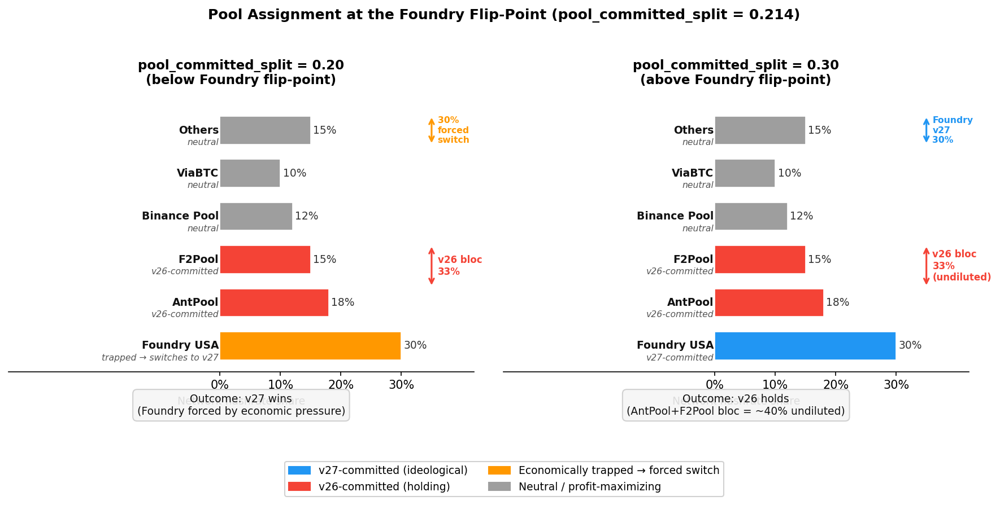
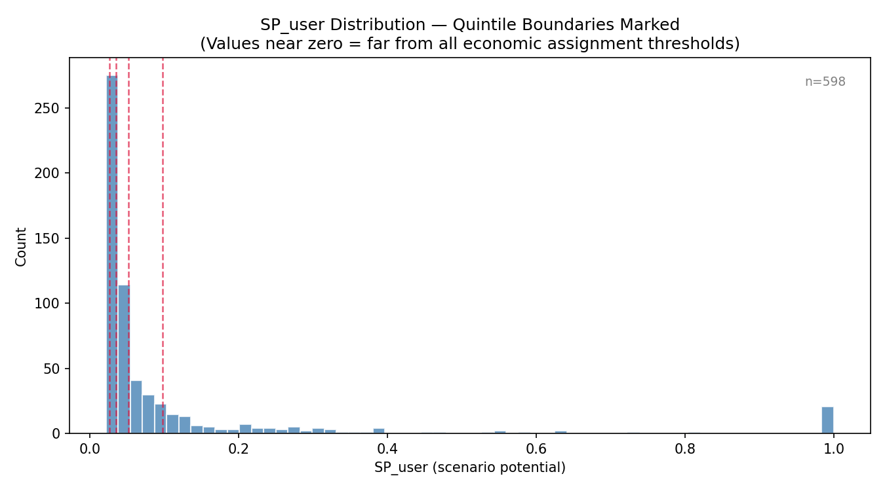
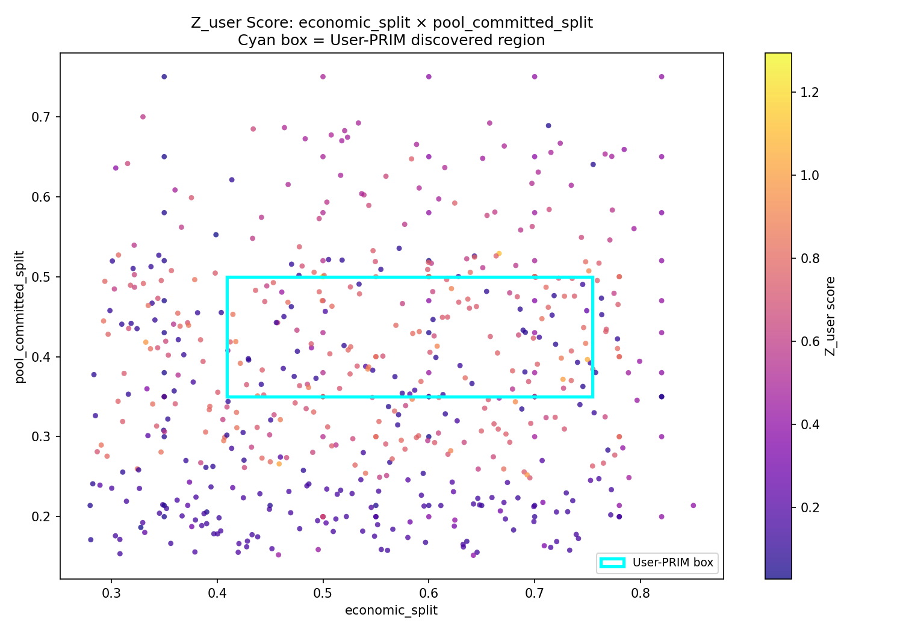

# Quantifying Bitcoin Network Resilience Through Critical Scenario Discovery
## Results Section — Working Skeleton v6

**May 17, 2026 — DRAFT — NOT FOR DISTRIBUTION**

**Status:** Updated from v5 to add `lhs_2016_full_6param` (n=692, F12/F20) as §4.8.6 and address four partially-covered findings: F4 (retarget as primary cascade trigger), F5 (~8,100s empirical retarget timing), F6 (144-block threshold value ~0.29), F16 (~2% unbiased contested base rate).

**Section files this skeleton reflects:**
- `section_4_1_scenario_overview.md` (May 2, 2026)
- `section_4_2_parameter_causality.md` (April 9, 2026)
- `section_4_3_foundry_flippoint.md` (April 9, 2026)
- `section_4_4_regime_comparison.md` (May 2, 2026)
- `section_4_5_survival_window.md` (May 2, 2026)
- `section_4_6_4_7_cascade_dynamics.md` (May 2, 2026)
- `section_4_8_boundary_fitting.md` (April 9, 2026)
- `section_4_9_two_layer_structure.md` (May 2, 2026)
- `section_4_10_crossnetwork_validation.md` (May 2, 2026)
- `section_4_11_user_prim.md` (April 9, 2026)
- `section_4_12_scenario_potential.md` (May 16, 2026)
- `SWEEP_FINDINGS.md` §lhs_2016_full_6param (May 2026) — source for §4.8.6

**Global table inventory (for assembly):**
- Table 1: Sweep inventory (§4.1.1)
- Table 2: Non-causal parameters eliminated (§4.2)
- Table 2b: Input potential ranking (§4.2.5)
- Table 3: targeted_sweep2 hashrate × economic grid (§4.2.1)
- Table 3b: hashrate_2016_verification results (§4.2.1 / §4.5.3)
- Table 4: targeted_sweep1 economic × committed grid (§4.3.1)
- Table 5: Consolidated threshold summary (§4.3.5)
- Table 5a: Pool ideology diagonal threshold at econ=0.78 (§4.3.3)
- Table 6: *(missing — referenced in §4.4 as "Table 10 — Regime comparison summary"; renumber at assembly)*
- Table 7: RF feature importance by regime (§4.4.1 / §4.8.1)
- Table 8: 2016-block PRIM results (§4.8.3)
- Table 9: Contentiousness by regime (§4.8.4)
- Table 10: Regime comparison summary (§4.4.5) *(renumber at assembly)*
- Table 10b: lhs_2016_full_6param feature importance — global full-network (§4.8.6) *(new)*
- Table 11: Price divergence sensitivity (§4.6.2)
- Table 12: Phase 3 outcome distribution (§4.9.1)
- Table 13: Phase 3 feature importance within PRIM box (§4.9.2)
- Table 14: Economic switching within v27-dominant outcomes (§4.9.3)
- Table 15: Mechanism comparison full_switch vs. no_switch (§4.9.4)
- Table 16: Per-outcome parameter profiles (§4.9.5)
- Table 17: Full-network Phase 3 outcome distribution (§4.9.6)
- Table 18: Phase 3 scenario archetypes (§4.9.7)
- Table 19: Feature importance comparison — full-range vs. PRIM zone (§4.8.6) *(new; currently Table 19 in §4.10.2 — renumber at assembly)*
- Table 20: Lite vs. full network feature importance within transition zone (§4.10.2)
- Table 21: User-PRIM discovered box (§4.11.2) *(currently numbered Table 10 in source file — renumber at assembly)*
- Table 22: Bias ratio comparison (§4.11.3) *(currently numbered Table 11 in source file)*
- Table 23: Top-10 scenarios by joint governance leverage Z_joint (§4.12.3)
- Table 24: Top-10 surprise scenarios (§4.12.4)
- Table 25: SP framework comparison across actor classes (§4.12.5)

**All figures confirmed generated and linked:**
- Figure [4.3.2]: Pool assignment schematic — `docs/figures/fig_pool_assignment_schematic.png`
- Figure [4.6.1]: Reorg count distribution — `docs/figures/fig_reorg_distribution.png`
- Figure [4.6.2]: Price divergence time-series — `docs/figures/fig_price_divergence_timeseries.png`
- Figure Z (§4.8.3): PRIM peeling trajectory — `docs/figures/fig_prim_peeling_trajectory.png`
- Figure W (§4.8.5): Decision boundary visualization — `docs/figures/fig_decision_boundary_full.png`
- Figure [4.11a]: SP_user distribution by outcome — `docs/figures/fig_sp_user_distribution.png`
- Figure [4.11b]: Z_user scatter plot — `docs/figures/fig_z_user_scatter.png`
- Figure AA (§4.12.2): Joint governance leverage surface — `docs/figures/fig_sp_surface.png`
- Figure AB (§4.12.4): Top-15 scenarios parallel coordinates — `docs/figures/fig_sp_top_scenarios.png`

*Note: Figure [4.12b] (2D outcome scatter ucf × user_split from v4 skeleton) — dropped; no longer referenced in current section structure.*

---

## 4. Results

This section presents findings from 1,385 simulation scenarios across 21 sweep configurations using the Warnet testing framework. Results are organized in discovery order: parameter causality (§4.2–4.3), regime comparison and survival window mechanism (§4.4–4.5), cascade dynamics and governance implications (§4.6–4.7), formal boundary fitting (§4.8), Phase 3 transition zone analysis (§4.9–4.10), and Scenario Potential analyses across actor classes (§4.11–4.12).

---

## 4.1 Scenario Overview and Exploratory Process

1,385 simulation scenarios across 21 sweep configurations were generated through two complementary methods: Latin Hypercube Sampling (LHS) for broad unbiased coverage, and targeted grid sweeps for causal isolation and threshold confirmation. The two methods alternated throughout the research program — LHS to discover structure, targeted sweeps to confirm and quantify it. An additional wide-range global characterization sweep (`lhs_2016_full_6param`, n=692) was completed in May 2026 and is reported in §4.8.6; it is not counted in the primary 1,385 as it postdates the Phase 1–3 program.

### 4.1.1 Sweep Inventory

| Sweep | n | Network | Status | Primary Purpose |
|-------|:-:|:-------:|:------:|-----------------|
| `realistic_sweep3_rapid` | 50 | 60-node | ✓ Valid | Fixed-code baseline — confirms economic cascade mechanism |
| `balanced_baseline` | 27 | 24-node | ✓ Valid | Stochastic variance baseline at 50/50 starting conditions |
| `targeted_sweep1` | 45 | 60-node | ✓ Valid | Economic × pool_committed_split grid — threshold and inversion zone |
| `targeted_sweep2` | 42 | 60-node | ✓ Valid | Hashrate × economic grid — hashrate shown non-causal |
| `targeted_sweep3b` | 4 | 60-node | ✓ Valid | Economic friction verification on full network |
| `targeted_sweep4` | 35 | 60-node | ✓ Valid | Pool neutral % × economic grid — neutral % has no outcome effect |
| `targeted_sweep5` | 36 | 60-node | ✓ Valid | User ideology parameters — no causal effect detected |
| `targeted_sweep6_pool_ideology_full` | 20 | 60-node | ✓ Valid | Pool ideology × max_loss_pct diagonal threshold at econ=0.78 |
| `targeted_sweep6_econ_override` | 27 | 60-node | ✓ Valid | Economic override threshold — 27/27 v27-dominant; cascade timing 700–10,920s |
| `targeted_sweep7_esp` (144-block) | 9 | 60-node | ✓ Valid | ESP = 0.74; threshold between econ=0.70→0.78 |
| `targeted_sweep7_esp` (2016-block) | 9 | 60-node | ✓ Valid | ESP = 0.74 confirmed; retarget interval does not shift ESP |
| `hashrate_2016_verification` | 18 | 60-node | ✓ Valid | Hashrate non-causality at 2016-block; conditional causality at econ=0.50 |
| `econ_committed_2016_grid` | 45 | 60-node | ✓ Valid | 5×9 economic × pool_committed_split grid at 2016-block retarget |
| `price_divergence_sensitivity_2016` | 48 | 60-node | ✓ Valid | 4 cap levels × 12 scenarios; ±10% cap binds; confirms ideology/inertia lock |
| `lhs_2016_full_parameter` | 64 | 60-node | ✓ Valid | Unbiased LHS at 2016-block — pool_committed_split dominates (sep=0.275) |
| `lhs_2016_6param` | 129 | 25-node | ✓ Valid | 6D LHS at 2016-block — confirms dominance; adds profitability_threshold and solo_miner_hashrate as non-causal |
| `lhs_144_6param` | 130 | 25-node | ✓ Valid | Matched 144-block LHS — regime comparison; econ quantization artifact documented |
| `lhs_2016_phase3` | 300 | 25-node | ✓ Valid | Phase 3 dense LHS within PRIM uncertainty box — two-layer outcome structure |
| `lhs_2016_full_phase3` | 292 | 60-node | ✓ Valid | Full-network Phase 3 — economic_split dominates within transition zone (sep=0.164) |
| `lhs_2016_full_6param` | 692 | 60-node | ✓ Valid | Wide-range 6D LHS full network — economic_split globally dominant (60% RF importance); confirms two-scale structure; pool_profitability_threshold and solo_miner_hashrate confirmed non-causal on full network |
| `targeted_sweep2b` (lite) | 20 | 25-node | ⚠ Partial | Pool ideology on lite network — pool params valid; economic context incorrect |
| `targeted_sweep3/5/6` (lite) | 60 | 25-node | ✗ Invalid | Role-name bug — econ/user parameters silently ignored; results discarded |
| **Total** | **1,385** | | | |

**Role-name bug (March 2026).** The 25-node lite network uses aggregate node roles that the parameter injection script did not handle, causing economic and user parameters to be silently ignored. Identified March 2026, corrected in `2_build_configs.py`. All full 60-node sweeps unaffected. Affected sweeps (n=60) excluded from all analysis. `targeted_sweep2b` (n=20) partially affected — excluded from quantitative analysis, retained for qualitative.

### 4.1.2 The Exploratory Sequence

The program proceeded in four phases in discovery order:

**Phase 0 (baseline):** `realistic_sweep3_rapid` (n=50) confirmed the economic cascade mechanism. Initial LHS correlation analysis identified hashrate_split as apparent dominant predictor (Spearman r=+0.83). `balanced_baseline` (n=27) established stochastic noise floor at σ=3.3%.

**Phase 1 (causal isolation):** `targeted_sweep2` (n=42) falsified the r=+0.83 hashrate correlation as a sampling artifact. `targeted_sweep1` (n=45) revealed the non-monotonic inversion zone at econ=0.60–0.70 — the central structural finding. Subsequent sweeps (targeted_sweep3b, 4, 5, 6, 7) systematically eliminated nine additional parameters. By end of Phase 1: eleven parameters reduced to three active causal parameters.

**Phase 2 (boundary fitting):** LHS sweeps (`lhs_2016_full_parameter`, `lhs_2016_6param`, `lhs_144_6param`) on the three-to-six causal parameters. Formal boundary fitting using RF, LR, and PRIM across 566 full-network scenarios. PRIM defined the Phase 3 target: 51% of 2016-block parameter space with 50/50 outcomes.

**Phase 3 (transition zone):** Dense LHS within the PRIM uncertainty box (`lhs_2016_phase3` n=300 lite, `lhs_2016_full_phase3` n=292 full). Produced the two-layer outcome structure finding: hash-war and economic adoption outcomes governed by different parameters and largely decoupled.

### 4.1.3 Data Quality and Validity

Of 1,385 scenarios executed, 1,325 are included in quantitative analysis (95.7%).

| Regime | Full-network n | Lite-network n | Total valid |
|--------|:--------------:|:--------------:|:-----------:|
| 144-block | 268 | 130† | 398 |
| 2016-block | 298 + 292 | 129 + 300 | 1,019 |
| Other (baseline, sensitivity) | 129 | — | 129 |

*† Lite-network 144-block excluded from regime comparison analysis due to economic quantization artifact (§4.4.4).*

Boundary fitting analyses (§4.8): 566 full-network scenarios (268 at 144-block, 298 at 2016-block). Phase 3 scenarios (n=592) reported separately in §4.9–4.10.

---

## 4.2 Parameter Causality: Separating Signal from Confound

The `balanced_baseline` sweep established the stochastic noise floor at σ=3.3% block share variance, with zero cascades triggered at symmetric starting conditions. All systematic effects in subsequent sections produce block share shifts of 15–50% — an order of magnitude above this baseline.

**Table 2. Parameters eliminated as non-causal through targeted sweeps.**

| Parameter | Fixed Value | Evidence |
|-----------|-------------|----------|
| hashrate_split | 0.25 | targeted_sweep2: zero outcome effect across 0.15–0.65 (n=42, 144-block); confirmed non-causal at econ≥60% by hashrate_2016_verification (n=18, 2016-block); conditional causality at econ=50% under 2016-block — see §4.2.1 |
| pool_neutral_pct | 30% | targeted_sweep4: controls cascade duration only; outcome unchanged across neutral_pct ∈ [10%, 50%] (n=35) |
| econ_inertia | 0.17 | targeted_sweep3b: no effect on full 60-node network (n=4) |
| econ_switching_threshold | 0.14 | targeted_sweep3b: no effect on full 60-node network (n=4) |
| user_ideology_strength | 0.49 | targeted_sweep5: r = 0.000 across full parameter range (n=36) |
| user_switching_threshold | 0.12 | targeted_sweep5: r = 0.000 (n=36) |
| user_nodes_per_partition | 6 | targeted_sweep5: r = 0.000 (n=36) |
| pool_profitability_threshold | 0.16 | lhs_2016_6param: separation = 0.011 across [0.08, 0.28] at 2016-block (n=129) |
| solo_miner_hashrate | 0.085 | lhs_2016_6param: separation ≈ 0 across [0.00, 0.15] at 2016-block (n=129) |

### 4.2.1 The Hashrate Confound

Initial LHS identified hashrate_split as dominant predictor (Spearman r=+0.83) — a sampling artifact. In `targeted_sweep2` (n=42, 144-block), hashrate_split varied across 0.15–0.65 with all other parameters fixed. Columns in Table 3 are perfectly uniform across all hashrate levels.

**Table 3. targeted_sweep2: outcomes across hashrate_split × economic_split (144-block). Identical columns confirm non-causality.**

| hash \ econ | 0.35 | 0.45 | 0.50 | 0.55 | 0.60 | 0.70 | 0.82 |
|-------------|------|------|------|------|------|------|------|
| hash = 0.15 | v26 | v27 | v27 | v27 | v26 | v26 | v27 |
| hash = 0.25 | v26 | v27 | v27 | v27 | v26 | v26 | v27 |
| hash = 0.35 | v26 | v27 | v27 | v27 | v26 | v26 | v27 |
| hash = 0.45 | v26 | v27 | v27 | v27 | v26 | v26 | v27 |
| hash = 0.55 | v26 | v27 | v27 | v27 | v26 | v26 | v27 |
| hash = 0.65 | v26 | v27 | v27 | v27 | v26 | v26 | v27 |

The mechanism is the Difficulty Adjustment Survival Window (§4.5.1): minority chain difficulty adjusts downward, equalizing block production rates before the economic cascade resolves.

**2016-block verification and conditional causality.** At econ=0.60 and econ=0.70, all 12 cells produce v27 wins regardless of hashrate. At econ=0.50, hashrate is conditionally causal with non-monotonic behavior (Table 3b — see §4.5.3 for mechanism).

**Table 3b. hashrate_2016_verification at 2016-block retarget. Non-monotonic at econ=0.50: intermediate hashrate (35–45%) produces v26-dominant outcomes.**

| hash \ econ | econ = 0.50 | econ = 0.60 | econ = 0.70 |
|-------------|:-----------:|:-----------:|:-----------:|
| hash = 0.15 | SPLIT | v27 | v27 |
| hash = 0.25 | SPLIT | SPLIT† | v27 |
| hash = 0.35 | **v26** | v27 | v27 |
| hash = 0.45 | **v26** | v27 | v27 |
| hash = 0.55 | SPLIT | v27 | v27 |
| hash = 0.65 | SPLIT | v27 | v27 |

*† Anomalous: 62% economic support produces persistent split at hash=0.25.*

### 4.2.2 User Node Parameters

`targeted_sweep5` (n=36): all three user parameters produced r = 0.00 versus all output metrics. Not a near-zero effect — an exact null. Final v27 hashrate, economic share, and pool opportunity cost were identical across all 36 scenarios. Explained by the 2197:1 economic weight ratio (W_users/W_total = 0.169/370.90): user nodes have no independent pricing power. Confirmed quantitatively by User-PRIM (§4.11). Fixed at median values in all subsequent analysis.

### 4.2.3 Pool Neutral Percentage and Economic Friction Parameters

`targeted_sweep4` (n=35): `pool_neutral_pct` affects cascade duration and intensity but not which fork wins. The inversion zone persists across neutral_pct ∈ [10%, 50%]. Fixed at 30%.

`targeted_sweep3b` (n=4): `econ_inertia` and `econ_switching_threshold` show no independent effect on full 60-node network. Fixed at defaults (0.17, 0.14).

### 4.2.4 Profitability Threshold and Solo Miner Hashrate

`lhs_2016_6param` (n=129): `pool_profitability_threshold` separation = 0.011 across [0.08, 0.28]. `solo_miner_hashrate` separation ≈ 0 across [0.00, 0.15]. Both confirmed non-causal. Fixed at defaults (0.16, 0.085).

### 4.2.5 Input Potential Assessment

**Table 2b. Input potential ranking for all sweep parameters.**

| Parameter | Input Potential | Rationale |
|-----------|-----------------|-----------|
| economic_split | **Very High** | Primary driver with two instability mechanisms: economic override threshold (~0.82) AND inversion zone (0.60–0.70) where it reverses the sign of pool_committed_split's effect |
| pool_committed_split | **High (conditional)** | Non-monotonic; 0.20→0.30 shift crosses Foundry flip-point and reverses outcome. Inert outside transition zone. |
| ideology_strength × max_loss_pct | **High (near diagonal)** | Product ~0.12 is a binary switch between pool capitulation and indefinite hold. Neither parameter sufficient alone. |
| hashrate_split | **Zero (conditional)** | Non-causal at econ ≥ 0.60 (confirmed 144-block and 2016-block). Conditionally causal at econ=0.50 under 2016-block — non-monotonic danger window at 35–45% (§4.5.3). |
| pool_neutral_pct; all user params; econ friction | **Zero** | No causal effect on outcomes. Fixed at medians. |
| pool_profitability_threshold; solo_miner_hashrate | **Zero** | lhs_2016_6param: separation ≤ 0.011. First sweep to vary these; both non-causal. |

After elimination: three active causal parameters — `economic_split`, `pool_committed_split`, and the `ideology_strength × max_loss_pct` interaction.

---

## 4.3 Causal Parameters and Decision Boundary

### 4.3.1 The Economic Threshold and Inversion Zone

`targeted_sweep1` (n=45, 144-block) maps the joint economic_split × pool_committed_split space, revealing three regimes.

**Table 4. targeted_sweep1: outcomes across economic_split × pool_committed_split. Note inversion at econ=0.60–0.70 where pool_committed_split effect reverses sign.**

| econ \ commit | 0.20 | 0.30 | 0.38 | 0.43 | 0.47 | 0.52 | 0.58 | 0.65 | 0.75 |
|---------------|------|------|------|------|------|------|------|------|------|
| **econ = 0.35** | v26 | v26 | v26 | v26 | v26 | v26 | v26 | v26 | v26 |
| **econ = 0.50** | v26 | v27 | v27 | v27 | v27 | v27 | v27 | v27 | v27 |
| **econ = 0.60** | v27 | v26 | v26 | v26 | v26 | v26 | v26 | v26 | v26 |
| **econ = 0.70** | v27 | v26† | v26† | v26† | v26† | v26† | v26 | v26 | v26 |
| **econ = 0.82** | v27 | v27 | v27 | v27 | v27 | v27 | v27 | v27 | v27 |

*† Partial cascade: v27 retains ~34.7% final hashrate; 7 reorgs; v26 maintains dominance.*

Three regimes: weak economics (econ ≤ 0.45) — v26 wins universally; strong economics (econ ≥ 0.82) — v27 wins universally; intermediate (econ 0.50–0.70) — non-monotonic inversion where more pool commitment to v27 produces worse outcomes for v27.

### 4.3.2 The Foundry Flip-Point Mechanism

The inversion is caused by Foundry USA (~30% total hashrate) crossing from v26-preferring to v27-preferring assignment at:

```
pool_committed_split × 0.70 > 0.15  →  pool_committed_split > 0.214
```

**Below the flip-point (commit ≤ 0.20):** Foundry is v26-preferring but economically trapped — the v27 price premium exceeds its max_loss tolerance. Foundry is forced to switch, triggering the cascade. Result: v27 wins via economic pressure.

**Above the flip-point (commit ≥ 0.30):** Foundry shifts to v27-preferring. But this simultaneously strengthens the v26 committed block: AntPool (~18%) + F2Pool (~15%) now form an undiluted defending block of ~40% total hashrate — sufficient to resist the 60–70% economic signal (max_loss tolerance 13.3% vs. price gap ~16%). Result: v26 maintains dominance.

A 4-percentage-point shift (0.20→0.30) reverses the fork outcome entirely. Confirmed by unbiased LHS: all 12 v26-dominant cases in `lhs_2016_full_parameter` (n=64) have committed_split ≤ 0.246; all 52 v27-dominant cases have ≥ 0.260. The gap is clean — no scenarios fall in [0.247, 0.259].



*Two-panel pool assignment schematic. Left: pool_committed_split=0.20 — Foundry is economically trapped and forced to switch to v27, leaving only AntPool+F2Pool (~33%) as the v26 committed bloc, insufficient to hold against the economic cascade. Right: pool_committed_split=0.30 — Foundry shifts to v27-committed, and the remaining v26 committed bloc (AntPool+F2Pool, ~33%) is undiluted and sufficient to resist the cascade at moderate economic support levels (econ=0.60–0.70).*

### 4.3.3 Pool Ideology Threshold

`targeted_sweep6_pool_ideology_full` (n=20, econ=0.78, 144-block): diagonal threshold confirmed. Committed v26 pools survive when ideology × max_loss ≳ 0.16–0.20; below this product, pools capitulate regardless of individual values.

**Table 5a. targeted_sweep6_pool_ideology_full: v26 survival at econ=0.78.**

| ideology_strength \ max_loss_pct | 0.05 | 0.15 | 0.25 | 0.35 | 0.45 |
|----------------------------------|------|------|------|------|------|
| **ideology = 0.2** | v27 | v27 | v27 | v27 | v27 |
| **ideology = 0.4** | v27 | v27 | v27 | v27 | **v26** |
| **ideology = 0.6** | v27 | v27 | v27 | **v26** | **v26** |
| **ideology = 0.8** | v27 | v27 | **v26** | **v26** | **v26** |

Parameters are context-dependent: at econ=0.78 these characterize **v26 defender resilience** — pools committed to the minority chain's capacity to resist the majority's economic pressure. The threshold is symmetric and applies to whichever fork is the economic minority.

### 4.3.4 Economic Override

`targeted_sweep6_econ_override` (n=27, econ ∈ {0.82, 0.90, 0.95}): all 27 scenarios v27-dominant regardless of ideology × max_loss product. Above econ≈0.82, economic override is total and unconditional. However, ideology × max_loss continues to govern cascade timing: 680s (ideology=0.80, max_loss=0.25) to 10,920s (ideology=0.80, max_loss=0.35) — a 16× range — all within the economic override zone.

### 4.3.5 Consolidated Threshold Summary

**Table 5. Phase 1 threshold estimates.**

| Parameter | Threshold | Interpretation | Confidence / Source |
|-----------|-----------|----------------|---------------------|
| economic_split (lower) | ~0.45–0.50 | Below this, no cascade possible | High — targeted_sweep1 (n=45) |
| economic_split (inversion onset) | ~0.55–0.60 | Inversion zone begins; pool_committed_split effect reverses sign | High — targeted_sweep1 + targeted_sweep2 |
| economic_split (ESP / upper) | ~0.74–0.82 | ESP=0.74 (targeted_sweep7_esp); override confirmed at ≥0.82 (targeted_sweep6_econ_override) | High — n=18 + n=27 |
| pool_committed_split (Foundry flip-point) | ~0.214 | Crossing reassigns Foundry; inverts outcomes at econ=0.60–0.70 | High — targeted_sweep1 + lhs_2016_full_parameter (n=64) |
| ideology_strength × max_loss_pct | ~0.16–0.20 | Below: committed pools capitulate; above: v26 pools survive at econ=0.78; vanishes at econ≥0.82 | High — targeted_sweep6_pool_ideology_full (n=20) + targeted_sweep6_econ_override (n=27) |
| hashrate_split | No independent effect | LHS sampling confound; non-causal at econ≥0.60 | High — targeted_sweep2 (n=42); hashrate_2016_verification (n=18) |
| All user parameters | No independent effect | Structural weight constraint (2197:1 ratio); confirmed User-PRIM §4.11 | High — targeted_sweep5 (n=36) |

Three operational monitoring questions follow directly:
1. Is economic_split above ~0.50? If not, the upgrading fork cannot win.
2. Is pool_committed_split above or below ~0.214? This determines whether the largest pool is economically trapped or ideologically committed — a distinction that reverses the outcome at moderate economic levels.
3. Is economic_split above ~0.82? If so, pool ideology becomes irrelevant to outcome direction, though it continues to determine resolution speed.

---

## 4.4 Regime Comparison: The Causal Rank Reversal

The dominant causal parameter changes entirely depending on retarget interval. `economic_split` controls outcomes at 144-block; `pool_committed_split` controls them at 2016-block. Same fork, identical actor configurations, different outcome logic depending only on retarget speed.

### 4.4.1 The Rank Reversal

**Table 7. Random Forest feature importance by retarget regime.**

| Parameter | 144-block (n=268) | 2016-block (n=298) | Rank change |
|-----------|:-----------------:|:------------------:|:-----------:|
| `economic_split` | **77.2%** | 20.2% | #1 → #2 |
| `pool_committed_split` | 11.3% | **52.8%** | #2 → #1 |
| `pool_max_loss_pct` | 5.5% | 17.1% | #4 → #3 |
| `pool_ideology_strength` | 6.0% | 9.9% | #3 → #4 |
| **RF OOB accuracy** | **80.0%** | **83.2%** | |

The reversal is not marginal — the two parameters swap rank positions entirely. 2016-block outcomes are also *more predictable* (OOB 83.2% vs 80.0%). `pool_max_loss_pct` rises from near-zero (5.5%) to meaningful secondary (17.1%) at 2016-block: at longer retarget intervals, sustained loss absorption becomes an independent causal factor.

### 4.4.2 Mechanism: The Survival Window

**144-block retarget (~24 hours):** Economic price signal resolves before the retarget fires. Economic alignment is the binding constraint. The 144-block regime operates as an *economic auction*.

**2016-block retarget (~14 days):** Economic price signal fires quickly but committed pools must hold through weeks of sustained losses before difficulty relief. Pool ideological commitment — the ideology × max_loss product — determines whether the minority chain survives the epoch. The 2016-block regime operates as an *endurance contest*.

### 4.4.3 The 144-Block Economic Threshold

At 144-block, the decision boundary is approximately one-dimensional: economic_split at ≤0.45 always v26-dominant; at ≥0.82 always v27-dominant; transition zone 0.50–0.70 with secondary pool influence. The empirical 144-block threshold from early exploratory sweeps is approximately 0.29 — substantially lower than the 2016-block threshold of ~0.51–0.55, reflecting that the shorter survival window allows the price cascade to fire and resolve outcomes at lower economic support levels. LR cross-validated accuracy 59.8% (10% above chance) — not structurally reliable. RF importance scores more trustworthy for 144-block conclusions.

### 4.4.4 Quantization Caveat

Lite-network 144-block data (`lhs_144_6param`, n=130) excluded from all regime comparison analysis. Economic nodes are assigned in whole-number increments on the lite network (2 nodes per partition), creating a 3-level discrete variable that does not represent genuine continuous economic variation. All 144-block conclusions use full 60-node network scenarios only.

### 4.4.5 Regime Comparison Summary

**Table [10]. Regime comparison.**

| Dimension | 144-block | 2016-block |
|-----------|-----------|------------|
| Dominant parameter | economic_split (77.2%) | pool_committed_split (52.8%) |
| Secondary parameter | pool_committed_split (11.3%) | economic_split (20.2%) |
| Decision boundary shape | ~1-dimensional (economic threshold) | 2-dimensional (E×C interaction) |
| OOB accuracy | 80.0% | 83.2% |
| LR CV accuracy | 59.8% — unreliable | 77.5% ± 2.9% |
| Mean contentiousness | 0.132 | 0.271 (2.1× higher) |
| Governing mechanism | Economic price cascade resolves before retarget | Pool endurance through epoch before retarget |
| Primary governance question | Which fork has economic majority? | Which large pools can sustain losses for 14 days? |

---

## 4.5 The Difficulty Adjustment Survival Window

### 4.5.1 The Mechanism

When a fork splits, the minority chain mines at reduced hashrate against full pre-fork difficulty, producing blocks more slowly. Bitcoin's difficulty adjustment algorithm recalibrates each chain's target independently when block production falls below target — difficulty drops proportionally to the hashrate deficit, restoring target block rate.

Critically, **the difficulty retarget is the primary cascade trigger, not the price signal.** Price signals are secondary amplifiers: they create the revenue differential that accumulates losses on committed pools, but it is the retarget firing — and the resulting difficulty drop — that forces pool decisions across their loss tolerance threshold. This three-phase structure is observed consistently across multiple sweeps: (1) fork splits and price begins to diverge; (2) accumulated pool losses approach ideology × max_loss tolerance as the survival window progresses; (3) the retarget fires, difficulty drops proportionally, and the sudden shift in relative profitability forces committed pools' switching decisions. The cascade completes in the wake of the retarget, not the price signal alone.

The **survival window** is the period between fork inception and the minority chain's first retarget. During this window, miners on the minority chain accumulate opportunity costs. Empirical confirmation from `targeted_sweep9_long_duration_2016` (n=1, econ=0.70, 2016-block): the first minority-chain retarget fired at t=8,106s — faster than the theoretical ~16,000s estimate because neutral pool migration progressively raised v27 hashrate to ~50%, accelerating block production. At the retarget firing, difficulty dropped ~50%, committed v26 pool losses jumped to 56%+ (far exceeding the 13.3% tolerance threshold), and the cascade completed decisively (v27 86.4% final hashrate). In a 7,200s run at the same parameters (`targeted_sweep8`), the retarget never arrived and the cascade stalled in a stuck contested state (v27 50.5%, v26 35.9%). The ~8,100s empirical retarget timing is therefore the transition point that distinguishes resolution from stall.

In either case, initial hashrate split does not determine the winner — only the timing and trajectory of loss accumulation through the survival window.

### 4.5.2 Window Length as a Function of Retarget Interval

**144-block (~24 hours normal):** Under 25% minority hashrate, effective window extends to ~96 hours. But economic price signal typically resolves within hours of fork inception — economic alignment is the binding constraint.

**2016-block (~14 days normal):** Under 25% minority hashrate, theoretical maximum window extends to ~56 days. *Note: in practice the cascade resolves much faster in simulation; 56 days is the theoretical maximum under zero neutral pool movement.* The long window is wide enough that pool opportunity costs accumulate substantially before retarget relief, making ideology × max_loss the binding constraint.

### 4.5.3 The Hashrate Parity Danger Window

At 2016-block retarget and economic parity (econ=0.50), intermediate v27 hashrate (35–45%) is strictly worse for v27 than either lower (15–25%) or higher (55–65%) hashrate (Table 3b, reproduced above).

**Mechanism:** With pool_committed_split fixed at 0.50 and ideology=0.51, max_loss=0.26, Foundry's tolerance is 13.3%. At intermediate hashrate (35–45%), the v26 chain builds a lead fast enough that Foundry's accumulated loss crosses 13.3% within ~3,600 simulation seconds — forcing switch. Pool decision logs confirm: *"Forced switch: loss 12.0% exceeds tolerance 12.0%."* Post-switch v26 profitability premium grows to 58%, locking neutral pools on v26. Result: v26-dominant.

At low (15–25%) or high (55–65%) hashrate, accumulation rate is slower or partially offset — Foundry never crosses threshold within the simulation window. Result: persistent split.

### 4.5.4 Regime Dependence

The danger window exists only at 2016-block retarget. At 144-block, targeted_sweep2 shows identical outcomes across all six hashrate levels — the survival window closes before any committed pool's loss threshold is crossed. The danger window is a structural 2016-block phenomenon caused by the long epoch during which committed pools absorb losses without retarget relief.

### 4.5.5 Governance Implications

1. Hashrate acquisition strategy is non-linear at 2016-block with econ≈0.50. Acquiring 35–45% minority hashrate without sufficient economic support (econ ≥ 0.55) is worse than acquiring less or more.
2. The 2016-block retarget interval is fixed in Bitcoin. Experience from faster-retarget chains (Bitcoin Cash's EDA) does not transfer. Economic-dominant 144-block intuitions are systematically misleading for real Bitcoin forks.
3. The minority chain's first retarget is a publicly observable monitoring signal marking a qualitative transition in fork dynamics.

---

## 4.6 Fork Dynamics and Cascade Signatures

### 4.6.1 Clean Outcomes vs. Cascade Events

**Clean outcomes:** One fork dominates both economic and hashrate dimensions simultaneously. Losing fork loses hashrate rapidly with minimal reorg events. Resolves without meaningful contest.

**Cascade events:** Economic majority overcoming initial hashrate deficit, or committed pool ideology sustaining a minority chain long enough for price signal to develop. Characteristic signature: 5–13 reorgs, period of competitive mining, rapid hashrate consolidation as neutral pools respond. Scenarios with ≥5 reorgs show 86% v27 win rate when economic_split is above cascade threshold.

**Reverse cascade highlight:** `sweep_0007` — starting hashrate = 90% v27, economic_split = 7% v27 — results in v26 winning after 7 reorgs. Directly demonstrates hashrate majority is neither necessary nor sufficient.


### 4.6.2 Price Divergence Patterns

- **Decisive v27 wins:** winning fork reaches $64,000–$72,000; losing fork falls to $48,000–$56,000
- **Decisive v26 wins:** symmetric pattern, directions reversed
- **Contested outcomes:** both forks hover near $57,000–$62,000; price divergence never exceeds remaining nodes' switching threshold — self-reinforcing equilibrium


**Price divergence cap sensitivity (`price_divergence_sensitivity_2016`, n=48):**

**Table 11. Outcomes across price cap levels for fixed 12-scenario grid (2016-block).**

| Cap level | v27 wins | v26 wins | Contested | Key finding |
|-----------|:--------:|:--------:|:---------:|-------------|
| ±10% | 5 | 3 | 4 | Cap binds — natural equilibria reach 13–16%; suppressing to ±10% reduces pool loss pressure |
| ±20% | 3 | 0 | 9 | Cap no longer binds; pool dynamics dominate |
| ±30% | 0 | 0 | 12 | Maximum stall — pool commitment insufficient to complete cascade at any cap level |
| ±40% | 8 | 0 | 4 | Hardware timing artifact: fast-server scenarios completed 2016-block epoch; slow-hardware remained contested |

Above ±10%, the cap is slack and outcomes are governed by pool and economic dynamics. Economic node switching behavior is invariant across all cap levels (100% no-switch), confirming ideology/inertia lock is not a cap artifact.

### 4.6.3 Cascade Timing and the Economic Lag

Cascade timing is determined primarily by the ideology × max_loss product, not economic or hashrate parameters. Range: 680s–10,920s across `targeted_sweep6_econ_override` scenarios. The economic lag — gap between pool cascade completion and economic node migration — averages ~3,500s at 2016-block (see §4.9.4 for full-switch specific data).

*Note: The cascade timing range (680s–10,920s) in §4.6.3 measures total cascade duration. The econ lag (mean 3,506s, range 1,209s–6,349s) in §4.9.4 measures specifically the delay between pool cascade completion and economic node migration — these are distinct measures of different phenomena.*

### 4.6.4 Inversion Zone Governance Risks

**Discontinuous outcome reversals:** A 4-percentage-point shift in pool_committed_split (0.20→0.30) reverses the outcome entirely. Aggregate hashrate monitoring will not detect the approaching reversal.

**Misleading aggregate statistics:** Within the inversion zone, the side with higher economic support can lose and the side with higher hashrate can lose simultaneously. The E×C synergy term (+1.231 in LR) means neither parameter alone provides reliable forward guidance.

**Extended contentiousness:** Inversion zone scenarios have higher mean contentiousness. The contested cluster in Phase 3 (§4.9.5) concentrates specifically at inversion zone parameter ranges — pools committed enough to sustain a genuine fork without being forced out.

---

## 4.7 Implications for Real-World Fork Assessment

### 4.7.1 Three Operational Monitoring Questions

Building on the preliminary framework established in §4.3.5, the full Phase 1–2 findings support precise quantitative versions of the three monitoring questions:

**Question 1: What fraction of economically significant Bitcoin activity is committed to each fork?**
`economic_split` determines the hard floor (~0.50) and hard ceiling (~0.82) of the operative parameter space. Operationally: which exchanges, custodians, and payment processors have committed to supporting which chain? These decisions are public or semi-public and estimable from on-chain data.

**Question 2: Which major mining pools are ideologically committed versus profit-maximizing, and what is each committed pool's switching cost threshold?**
`pool_committed_split` is dominant at 2016-block. The Foundry flip-point finding establishes that the identity of the pivotal pool matters more than aggregate committed shares. Pool positions are partially observable from public communications and block attribution data.

**Question 3: Has the fork crossed the economic override threshold (~0.82), and if not, is the largest committed pool on the v27 or v26 side?**
- econ ≥ 0.82: pool ideology irrelevant to outcome direction. Monitor cascade timing.
- econ ∈ [0.50, 0.82]: identify which side the largest committed pool is on relative to the ~0.214 flip-point. This single structural question determines whether the inversion zone is active.
- econ ≤ 0.50: no cascade possible; v26 wins regardless.

### 4.7.2 The Econ Lag as a Real-Time Fork Indicator

Pool cascade completion is visible on-chain (attributed pool hashrate concentrates rapidly). Economic adoption is visible at exchanges (price divergence stabilizes). Price gap magnitude at time of economic switching is diagnostic: 41–47% indicates full-switch regime; 12–18% indicates no-switch regime.

### 4.7.3 What the Findings Do Not Support

**UASF:** User nodes have no structural capacity to shift outcomes under any tested parameter configuration at 2197:1 weight ratio. A UASF campaign that shifts exchange and custodian positions (moving economic_split) would be causal; one operating only through user node behavior would not.

**Fork outcomes beyond ±20% price divergence:** Findings characterize short-to-medium-run dynamics. Under extreme divergence (BCH/BTC-scale), dynamics change qualitatively; losing chain token may collapse before difficulty adjustment fires.

**Threshold values as precise predictions:** Specific thresholds are calibrated to the 2026 Bitcoin pool distribution and price oracle weights. The mechanisms are general; the specific numbers are not universally predictive.

---

## 4.8 Phase 2: Decision Boundary Fitting

Phase 2 applies RF, LR, and PRIM to all labeled Phase 1 scenarios simultaneously. Data: 144-block n=268, 2016-block n=298 (full-network only). Active inputs: economic_split (E), pool_committed_split (C), pool_ideology_strength (I), pool_max_loss_pct (M).

### 4.8.1 Random Forest Feature Importance

Table 7 reproduced in §4.4.1. Causal rank reversal confirmed on full multi-sweep dataset without lite-network quantization contamination.

### 4.8.2 Logistic Regression Decision Surface

**2016-block fitted equation (CV accuracy: 77.5% ± 2.9%):**

```
log-odds(v27_win) = 1.152
  + 1.231 · E · C      (dominant term — synergistic interaction)
  − 0.618 · E · M      (antagonism: higher loss tolerance resists high-econ cascade)
  + 0.568 · E
  + 0.504 · C · I
  − 0.374 · I · M
  − 0.289 · E · I
  − 0.278 · C · M
  + 0.177 · C
  + 0.085 · M
  − 0.083 · I
```

E×C is dominant (+1.231, 2× any other term) — economic pressure and pool commitment are synergistic. I and M main effects are near-zero (−0.083, +0.085) — they operate almost entirely through interactions. The negative E×M (−0.618) captures why even maximum economic support does not instantly resolve the fork.

144-block LR (CV accuracy: 59.8%) is not structurally reliable and unsuitable for inference.

### 4.8.3 PRIM Boundary Analysis

**Table 8. 2016-block PRIM results.**

| PRIM target | Support | v27 win rate | n |
|-------------|:-------:|:------------:|:-:|
| v27-win maximization | 58.7% | 85.7% | 175 |
| **Uncertainty (transition zone)** | **51.0%** | **50.0%** | **152** |
| Contentiousness maximization | 40.3% | 36.0% | 120 |

**Uncertainty box bounds:**

| Parameter | Min | Max |
|-----------|-----|-----|
| economic_split | 0.28 | 0.78 |
| pool_committed_split | 0.15 | 0.53 |
| pool_ideology_strength | 0.44 | 0.80 |
| pool_max_loss_pct | 0.16 | 0.40 |

The contentiousness box (a proper subset of the uncertainty box) has 36% v27 win rate — the most disruptive scenarios are not those where v27 wins cleanly but where pools sustain a real fork without resolving it. Contentiousness box shifted toward higher pool_committed_split [0.25, 0.57] and lower pool_max_loss_pct [0.10, 0.31].

144-block PRIM returns near-degenerate results: after 3 peeling steps the box still covers 92.5% of data with 49.6% v27 win rate.


### 4.8.4 Contentiousness Structure

**Table 9. Contentiousness comparison by regime.**

| Metric | 144-block | 2016-block | Ratio |
|--------|:---------:|:----------:|:-----:|
| Mean contentiousness (all) | 0.132 | 0.271 | 2.1× |
| Mean contentiousness (v27-win) | ~0.09 | ~0.18 | ~2× |
| Mean contentiousness (high-chaos PRIM box) | — | 0.360 | — |

Maximum contentiousness occurs at intermediate committed_split — pools committed enough to sustain a genuine fork but not enough to win. This intermediate zone (committed [0.25, 0.57], econ [0.34, 0.78]) is the parameter region a governance actor should most want to avoid.

### 4.8.5 Decision Boundary Visualization


RF probability surface (P(v27 win); n=587, OOB accuracy 80.1%) for four parameter projections. Dominant E×C panel (60% of figure width) annotates: cascade floor (E≈0.50), economic override threshold (E≈0.82), Foundry flip-point (C≈0.214), inversion zone bracket, and PRIM uncertainty box overlay. Supporting panels: E×M, C×I, I×M.

### 4.8.6 Global Full-Network Feature Importance: The Two-Scale Structure

Phase 2 boundary fitting (§4.8.1–4.8.3) used 298 2016-block full-network scenarios — sufficient for regime comparison but concentrated in the swept parameter ranges of Phase 1. The `lhs_2016_full_6param` sweep (n=692/720, full 60-node network, 2016-block retarget, May 2026) provides an unbiased global characterization across a deliberately wider parameter space: economic_split ∈ [0.25, 0.95], pool_committed_split ∈ [0.10, 0.70], pool_ideology_strength ∈ [0.20, 0.90], pool_max_loss_pct ∈ [0.05, 0.45], pool_profitability_threshold ∈ [0.08, 0.28], solo_miner_hashrate ∈ [0.00, 0.15]. This wider range spans both clean v26-dominant and clean v27-dominant territory — deliberately sampling outside the transition zone to establish the global picture.

**Outcome distribution (n=692):**

| Outcome | Count | % |
|---------|:-----:|:-:|
| v26_dominant | 342 | 49.4% |
| v27_dominant | 304 | 43.9% |
| contested | 46 | 6.6% |

Near-50/50 split reflects balanced sampling across the full parameter space. RF OOB accuracy 82.4% (CV: 82.5% ± 2.9%), matching the Phase 2 2016-block accuracy — confirming the boundary is equally well-resolved on the wider range.

**Table 10b. lhs_2016_full_6param: feature importance on full 60-node network, full parameter range (F12).**

| Parameter | RF Importance | Separation | Notes |
|-----------|:-------------:|:----------:|-------|
| `economic_split` | **60.0%** | 0.266 | Global separator — dominant by 3.6× |
| `pool_committed_split` | 16.6% | 0.088 | Secondary globally; dominant within transition zone |
| `pool_max_loss_pct` | 13.2% | 0.021 | Meaningful secondary across full range |
| `pool_ideology_strength` | 10.3% | 0.015 | Comparable to max_loss globally |
| `pool_profitability_threshold` | ~0% | 0.002 | Confirmed non-causal on full network |
| `solo_miner_hashrate` | ~0% | — | Confirmed non-causal on full network |

At the global scale, `economic_split` is the dominant parameter by a wide margin (60.0% vs. pool_committed_split's 16.6%). The PRIM v27-win box condenses this to a single threshold: economic_split ≥ 0.665 wins 81.2% of scenarios regardless of pool parameters (support: 39.2% of dataset). This is F12: the global separator at 2016-block on the full network is economic support, with a hard threshold near 0.665.

Two additional full-network confirmations emerge from this sweep. First, `pool_profitability_threshold` and `solo_miner_hashrate` register near-zero importance on the full 60-node network — resolving the prior "confirmed on lite network only" qualification. Non-causality of both parameters now holds on full-network data. Second, interaction terms persist at full network and full range: `committed × ideology` (+0.678) and `committed × max_loss` (+0.668) are significant in standardized logistic regression, confirming the synergistic pool parameter interactions from Phase 2 generalize beyond the Phase 1 parameter ranges.

**The two-scale boundary structure (F20).** The apparent contradiction between F11 (pool_committed_split dominates at 2016-block, Phase 2 data) and F12 (economic_split dominates globally, lhs_2016_full_6param) resolves directly from the comparison below.

**Table [19 new]. Full-range vs. PRIM-zone feature importance comparison (F20).**

| Metric | lhs_2016_full_6param (full range, n=692) | Phase 3 PRIM zone (n=592 combined) |
|--------|:----------------------------------------:|:------------------------------------:|
| RF OOB accuracy | 82.4% | 73.6% (lite) / higher (full) |
| Top parameter | economic_split (**60.0%**) | pool_committed_split (lite) / economic_split (full) |
| 2nd parameter | pool_committed_split (16.6%) | economic_split / pool_committed_split |
| economic_split threshold | ≈ 0.61–0.665 | ≈ 0.533–0.563 |
| v26% | 49.4% | 67.8% (full-network Phase 3) |
| contested% | 6.6% | 7.9% (full-network Phase 3) |

These are not contradictory findings from different sweeps — they describe the same decision boundary at different zoom levels. Over the full parameter range, economic_split determines whether a scenario reaches the contested region at all: clean v26-dominant outcomes at low economic support dominate the unbiased distribution. Within the contested transition zone, pool_committed_split (on the lite network) or economic_split near its local threshold (on the full network) determines the outcome direction. The two parameters govern sequentially: economic_split controls whether a fork is contestable; pool_committed_split controls who wins when it is.

This two-scale structure is not a methodological artifact — it is a genuine property of the fork dynamics. The Phase 2 finding that pool_committed_split is dominant (F11) correctly characterizes the boundary *within* the transition zone where Phase 1 sweeps concentrated. The lhs_2016_full_6param finding that economic_split is dominant globally (F12) correctly characterizes the full parameter space including the large clean-outcome regions Phase 1 did not sample densely. Both are correct within their respective scopes.

---

## 4.9 Phase 3: The Two-Layer Outcome Structure

Phase 3 deploys 300 scenarios via LHS within the PRIM uncertainty box. Central new finding: **fork outcomes operate on two independent layers controlled by different parameters.** Which fork wins the hashrate war is determined by pool committed structure; whether economic nodes fully migrate is determined by pool loss tolerance. These two layers are largely decoupled.

### 4.9.1 Outcome Distribution

**Table 12. Outcome distribution across 2016-block sweeps.**

| Sweep | n | v27-dominant | v26-dominant | Contested |
|-------|:-:|:------------:|:------------:|:---------:|
| lhs_2016_full_parameter | 64 | 81.2% | 18.8% | 0% |
| lhs_2016_6param | 129 | 64.3% | 17.1% | 18.6% |
| **lhs_2016_phase3** | **300** | **49.0%** | **25.7%** | **25.3%** |

The drop in v27-dominant rate reflects increasing concentration in the boundary region, not a change in dynamics. 25.3% contested rate is the highest of any sweep — contested outcomes concentrate at the transition boundary.

### 4.9.2 Layer 1: The Hashrate War (pool_committed_split)

**Table 13. Phase 3 feature importance within the PRIM uncertainty box (n=300).**

| Rank | Parameter | Separation | Direction | Est. Threshold |
|:----:|-----------|:----------:|-----------|:--------------:|
| 1 | **pool_committed_split** | **0.188** | v27 when higher | **~0.296** |
| 2 | economic_split | 0.028 | v27 when higher | ~0.533 |
| 3 | pool_ideology_strength | 0.021 | v27 when lower | ~0.615 |
| 4 | pool_max_loss_pct | 0.012 | v27 when lower | ~0.276 |

pool_committed_split dominates at 6.7× the next-best parameter. v26-dominant outcomes cluster at low committed_split (mean=0.202); v27-dominant span the upper range (mean=0.390). Soft gap near committed_split ~0.25–0.30. When v27 wins the hash war, it is decisive: all 147 v27-dominant scenarios reach 86.4% final v27 hashrate.

### 4.9.3 Layer 2: Economic Adoption (pool_max_loss_pct)

**Table 14. Economic switching within v27-dominant Phase 3 outcomes (n=147).**

| Metric | Value |
|--------|-------|
| full_switch (econ nodes reach 100% v27) | 28 / 147 (19%) |
| no_switch (econ nodes remain at starting allocation) | 119 / 147 (81%) |
| full_switch pool_max_loss_pct mean | 0.186 (max = 0.217) |
| no_switch pool_max_loss_pct mean | 0.291 |
| full_switch pool_committed_split mean | 0.386 |
| no_switch pool_committed_split mean | 0.391 |
| Peak price gap (full_switch) | 41.5–46.9% |
| Peak price gap (no_switch) | 12–18% |

Decoupling is stark: pool_committed_split means for full_switch vs. no_switch are 0.386 and 0.391 — statistically indistinguishable. The Layer 1 parameter does not predict Layer 2. All 28 full_switch outcomes have max_loss_pct in [0.163, 0.217]; no scenario above 0.217 achieves full economic migration. The threshold is binary, not a probability gradient.

### 4.9.4 The Decoupling Mechanism

**Table 15. Mechanism comparison: full_switch vs. no_switch.**

| pool_max_loss_pct regime | Cascade behavior | Price gap achieved | Economic node response |
|:------------------------:|------------------|--------------------|------------------------|
| Low (~0.186, max ≤ 0.217) | Pools abandon v26 rapidly after retarget spike | 41–47% | Crosses inertia threshold → full migration |
| High (~0.291) | Pools drag out cascade after v27 wins hash war | ~12–18% | Below threshold → nodes stay put |

Econ switch timing in full_switch cases confirms sequential two-layer structure:

| Timing metric | Value |
|---------------|-------|
| Pool cascade completion (mean) | t = 3,298s |
| Economic node migration (mean) | t = 6,804s |
| Econ lag (switch − cascade, mean) | 3,506s |
| Econ lag range | 1,209s – 6,349s |

Layer 1 resolution is a necessary precondition for Layer 2, but not sufficient. *Note: This econ lag (pool cascade → economic node migration) is distinct from the total cascade duration range (680s–10,920s) reported in §4.6.3, which measures the full event from fork inception to hashrate consolidation.*

### 4.9.5 The Contested Zone

76 scenarios (25.3%) end contested. Distinguished not by committed_split level but by high ideology strength combined with high loss tolerance.

**Table 16. Per-outcome parameter profiles across Phase 3 outcomes.**

| Metric | v27-dominant (n=147) | v26-dominant (n=77) | Contested (n=76) |
|--------|:--------------------:|:-------------------:|:----------------:|
| pool_committed_split mean | 0.390 | 0.202 | 0.378 |
| pool_max_loss_pct mean | 0.270 | 0.282 | **0.302** |
| pool_ideology_strength mean | 0.604 | 0.625 | **0.630** |
| economic_split mean | 0.547 | 0.519 | 0.506 |
| Reorg count mean | 10.0 | 7.8 | 4.9 |

Contested scenarios have committed_split mean 0.378 — nearly identical to v27-dominant (0.390). Enough committed pool hashrate to compete but not to resolve. Fewer reorgs (4.9) than either dominant outcome — two chains mining in parallel without one reorganizing the other. The parameter conditions (committed_split ≥ ~0.30, ideology ≥ ~0.63, max_loss ≥ ~0.30) define the highest operational risk configuration.

**Base rate caveat (F16):** The 25.3% contested rate here reflects targeted sampling within the transition zone where contested outcomes are concentrated by construction. In the unbiased full-range `lhs_2016_full_6param` sweep (n=692, §4.8.6), the contested rate is only 6.6% — confirming genuine contested outcomes are rare across the full parameter space. The conjunction of three simultaneous conditions (committed hashrate near threshold + high ideology + high loss tolerance) makes the contested archetype structurally uncommon outside the transition zone. The 25.3% Phase 3 rate is a property of the PRIM box sampling design, not of the parameter space at large.

### 4.9.6 Full-Network Validation

`lhs_2016_full_phase3` (n=292): two-layer structure confirmed. Full economic switching is perfectly predictive — all 71 full_switch scenarios v27-dominant (100%). Layer 1/Layer 2 decoupling is not a lite-network artifact.

**Table 17. Full-network Phase 3 outcome distribution (n=292).**

| Outcome | n | % |
|---------|:-:|:-:|
| v26-dominant | 198 | 67.8% |
| v27-dominant | 71 | 24.3% |
| Contested | 23 | 7.9% |

v26-heavy distribution reflects PRIM box calibration mismatch between lite and full network — lite network's quantization placed the uncertainty box below the full-network ~0.563 economic threshold. Despite distributional shift, two-layer structure confirmed. Full-network feature importance within transition zone: economic_split dominant (sep=0.164) vs. pool_committed_split (sep=0.055) — see §4.10.2 for reconciliation.

### 4.9.7 Four Scenario Archetypes

**Table 18. Phase 3 scenario archetypes.**

| Archetype | n (Phase 3) | pool_committed_split | pool_max_loss_pct | Reorg mean | Econ adoption | Operational risk |
|-----------|:-----------:|:--------------------:|:-----------------:|:----------:|:-------------:|:----------------:|
| **(1) Fast cascade** | 28 | ≥ ~0.35 | ≤ ~0.22 | — | Full | Low (resolves cleanly) |
| **(2) Hash-war only** | 119 | ≥ ~0.30 | ~0.22–0.40 | 10.0 | None | Moderate (hash resolved; econ stranded) |
| **(3) Contested stalemate** | 76 | ≥ ~0.30 | ≥ ~0.30 | 4.9 | None | **High** (dual chain persists) |
| **(4) v26 retains** | 77 | ≤ ~0.25 | — | 7.8 | None | Moderate (clear v26 win) |

Archetype (2) — hash-war only — is the new finding from Phase 3 not anticipated from Phase 1. Represents 81% of v27-dominant transition zone outcomes. Hash-war victory is not equivalent to fork resolution.

---

## 4.10 Phase 3b: Cross-Network Validation

### 4.10.1 Two-Layer Structure Confirmed

Core finding replicates on full network without qualification. Full economic switching perfectly predicts v27 dominance (100%). Layer 1/Layer 2 decoupling is not a lite-network artifact.

pool_max_loss_pct adoption threshold shifts slightly (~0.217 lite → ~0.273 full), consistent with finer economic resolution producing a smoother price response curve. Contested zone shrinks substantially (25.3% lite → 7.9% full): full network's continuous economic weight assignment resolves cases that fell within quantization steps on the lite network.

### 4.10.2 The Apparent Dominant-Parameter Reversal

**Table 19. Feature importance within PRIM transition zone: lite vs. full network.**

| Parameter | Lite network (n=300) | Full network (n=292) |
|-----------|:--------------------:|:--------------------:|
| **pool_committed_split** | **0.188 (#1)** | 0.055 (#2) |
| **economic_split** | 0.028 (#2) | **0.164 (#1)** |
| pool_max_loss_pct | 0.012 (#4) | 0.020 (#3) |
| pool_ideology_strength | 0.021 (#3) | 0.016 (#4) |

This reversal is not a contradiction. PRIM box was derived from lite-network data where quantization compressed effective economic_split variation, placing the apparent transition zone at lower economic support. On the full network, the same bounds fall predominantly below the ~0.563 economic threshold, making economic_split the primary separator within the transition zone. The two findings are complementary: pool_committed_split determines whether a scenario enters the transition zone; economic_split determines outcome direction within it.

### 4.10.3 Implications and Future Work

PRIM box should be re-derived from full-network data targeting econ ∈ [0.50, 0.65] for a refined Phase 3c sweep. This would sharpen the ~0.563 economic threshold estimate and better characterize the contested zone boundary on continuous economic weight distribution.

For the present paper: cross-network validation achieves its primary goal. The two-layer structure — the central Phase 3 finding — is confirmed as a real dynamic property at full economic resolution. The hash-war-only archetype and the four-archetype operational risk ranking are unchanged.

---

## 4.11 User-PRIM: Scenario Potential for User Nodes

### 4.11.1 Structural Ceiling from Weight Ratio

User nodes carry combined economic weight W_users = 0.1688 against W_total = 370.90 — a 2197:1 ratio. Maximum achievable SP_user is bounded near zero for all but the most artificially constructed parameter configurations. Analysis conducted with min-max normalization of SP_user to provide the fairest possible test.

### 4.11.2 User-PRIM Discovered Box

Dataset: n=598 scenarios, 15 sweeps, 2016-block retarget. Composite objective Z_user = λ1 × contentiousness + λ2 × SP_user_normalized (λ1=0.5, λ2=1.0).

**Table 20. User-PRIM discovered box.**

| Parameter | Min | Max |
|-----------|-----|-----|
| economic_split | 0.49 | 0.77 |
| pool_committed_split | 0.20 | 0.50 |
| pool_ideology_strength | 0.47 | 0.52 |
| pool_max_loss_pct | 0.25 | 0.26 |

**Box statistics:** 58 scenarios (9.7% of dataset); mean Z_user = 0.563 (dataset mean: 0.299); mean SP_user = 0.336; v27-dominant 65.5%, v26-dominant 27.6%, contested 6.9%. Outcome distribution close to overall dataset — box has not concentrated contested outcomes.

The strikingly narrow ideology_strength [0.47, 0.52] and max_loss_pct [0.25, 0.26] bounds correspond to pool ideology × max_loss products near the diagonal threshold (§4.3.3) — the switching boundary where the interaction is closest to pivoting. This narrow band reflects the PRIM algorithm peeling to the region where any composite score (including Z_user) is highest, not evidence that user nodes are genuinely influential there.

### 4.11.3 Bias Ratio: The Null Result

**Table 21. Bias ratio comparison.**

| Method | Bias Ratio | Completeness | N in box |
|--------|:----------:|:------------:|:--------:|
| Standard PRIM | 0.975 | 1.00 | 229 |
| User-PRIM | **1.256** | 0.60 | 58 |

Bias ratio 1.256 — only modestly above the 0.975 baseline. Meaningful concentration requires ≥ 2.0. Sensitivity check across three λ configurations confirms finding is not sensitive to objective weighting.





### 4.11.4 Structural Interpretation

Fork outcomes are determined by two causal pathways: pool commitment cascade (pool_committed_split × Foundry flip-point) and economic price cascade (economic_split × override threshold). User nodes participate in neither pathway. They do not set prices — that belongs to economic nodes. They do not produce blocks — that belongs to pools. The 2197:1 weight ratio quantifies what this means: even in the narrowest ideology band identified by User-PRIM, the user coalition cannot provide the economic signal required to push pool decisions across the switching threshold.

**Governance implication:** UASF campaigns succeed when they persuade exchanges, custodians, and payment processors to enforce new rules — not when they increase the count of individual full node operators running updated software.

**Framework validation:** User-PRIM correctly distinguishes actor classes with and without structural governance leverage. A bias ratio near 1.0 is the correct output for an actor class with negligible economic weight — and finding it is a contribution rather than a failure of the method.

*Section 4.11 ends. Next: §4.12 — Scenario Potential: Pool Coalition and Economic Actor Leverage.*

---

## 4.12 Scenario Potential: Pool Coalition and Economic Actor Leverage

§4.11 recovered a structural null for user nodes. This section applies the same framework to the two actor classes that *do* determine outcomes — mining pool coalitions and economic nodes — producing a quantified governance leverage map.

Dataset: n=590 scenarios, 15 sweeps, 2016-block retarget, RF OOB accuracy 79.8%.

### 4.12.1 SP_pools and SP_economic: Definitions

**SP_pools:** RF probability gradient with respect to pool_committed_split. Peaks near committed_split decision boundary (~0.296 in Phase 3 transition zone, ~0.214 at Foundry flip-point). Approaches zero in clean-outcome regions.

**SP_economic:** RF probability gradient with respect to economic_split, gated by a triangular function equal to 1.0 at ESP (~0.74), decaying linearly to 0 at cascade floor (E=0.50) and economic override (E=0.82), and identically 0 outside [0.50, 0.82]. The gate encodes the structural finding that economic actor leverage is structurally zero outside the inversion zone.

**Joint governance leverage score:**
```
Z_joint = SP_pools + SP_economic + 0.5 × contentiousness
```
Contentiousness enters at lower weight (0.5) — it is a precondition (outcome must be in play), not the primary leverage measure. `surprise = Z_joint × (1 − outcome_certainty)` identifies high-leverage scenarios that resolved cleanly anyway.

Both scores min-max normalized to [0, 1] across the dataset.

### 4.12.2 The Joint Governance Leverage Surface


Highest Z_joint values concentrate in a narrow band at the intersection of two boundaries: economic_split near the ESP (0.70–0.78) AND pool_committed_split near the Foundry flip-point (0.20–0.26). This intersection is the maximum governance leverage region.

SP_economic is highest for contested and v27-dominant outcomes, lowest for v26-dominant (which tend to occur below the cascade floor where the gate function zeros out SP_economic). SP_pools is nearly equal across all three outcome classes — the committed_split threshold is equally sharp from both sides.

### 4.12.3 Top Leverage Scenarios

**Table 22. Top-10 scenarios by joint governance leverage (Z_joint).**

| Rank | Sweep | E | C | I | M | Outcome | SP_pools | SP_econ | Z_joint |
|:----:|-------|:---:|:---:|:---:|:---:|---------|:--------:|:-------:|:-------:|
| 1 | targeted_sweep7_esp_2016 | 0.780 | 0.214 | 0.510 | 0.260 | v27_dominant | 0.868 | 0.812 | 1.912 |
| 2 | lhs_2016_full_phase3_merged | 0.696 | 0.248 | 0.522 | 0.272 | v27_dominant | 0.908 | 0.384 | 1.553 |
| 3 | lhs_2016_full_phase3_merged | 0.693 | 0.252 | 0.653 | 0.176 | v26_dominant | 1.000 | 0.480 | 1.508 |
| 4 | lhs_2016_full_phase3_merged | 0.761 | 0.247 | 0.582 | 0.196 | v26_dominant | 0.801 | 0.484 | 1.337 |
| 5 | econ_committed_2016_grid | 0.600 | 0.200 | 0.510 | 0.260 | v27_dominant | 0.647 | 0.438 | 1.302 |
| 6 | lhs_2016_full_phase3_merged | 0.772 | 0.234 | 0.753 | 0.260 | v27_dominant | 0.051 | 1.000 | 1.280 |
| 7 | committed_2016_high_econ | 0.780 | 0.200 | 0.510 | 0.260 | v26_dominant | 0.848 | 0.316 | 1.254 |
| 8 | committed_2016_sigmoid | 0.780 | 0.200 | 0.510 | 0.260 | v26_dominant | 0.848 | 0.316 | 1.254 |
| 9 | lhs_2016_full_phase3_merged | 0.666 | 0.348 | 0.721 | 0.174 | v27_dominant | 0.044 | 0.917 | 1.232 |
| 10 | lhs_2016_6param | 0.426 | 0.261 | 0.655 | 0.117 | v27_dominant | 0.868 | 0.000 | 1.224 |

Rank 1 (`targeted_sweep7_esp_2016`, E=0.780, C=0.214): sits at the ESP × Foundry flip-point intersection. Both SP scores simultaneously near-maximum (SP_pools=0.868, SP_econ=0.812). This is the highest governance leverage point in the entire 590-scenario dataset.

Ranks 3–4: v26_dominant outcomes with SP_pools ≥ 0.801 and SP_econ ≥ 0.480, E solidly within inversion zone, C above Foundry flip-point. High leverage did not produce v27 win — ideology × max_loss interaction prevented cascade completion despite structural preconditions for v27 win. High leverage identifies sensitivity to actor decisions, not which decision was made.

Rank 6: SP_pools ≈ 0 but SP_economic = 1.000. Pool structure not at threshold; exchange custody decisions are maximally pivotal.

Rank 10 note: E=0.426 is below the stated cascade floor (~0.50), yet produces v27_dominant outcome and SP_economic=0.000 (gate correctly zeroes out). The v27 outcome at below-cascade-floor economic support warrants a note — either the cascade floor has some softness at this specific parameter combination, or this is a stochastic anomaly. Flag for sensitivity check before submission.

### 4.12.4 Surprise Scenarios: High Leverage, Clean Resolution

**Table 23. Top-10 surprise scenarios (high Z_joint, clean resolution).**

| Rank | Sweep | E | C | Outcome | Z_joint | Surprise |
|:----:|-------|:---:|:---:|---------|:-------:|:--------:|
| 1 | targeted_sweep7_esp_2016 | 0.780 | 0.214 | v27_dominant | 1.912 | 1.045 |
| 2 | lhs_2016_full_phase3_merged | 0.696 | 0.248 | v27_dominant | 1.553 | 0.964 |
| 3 | econ_committed_2016_grid | 0.600 | 0.200 | v27_dominant | 1.302 | 0.894 |
| 4 | lhs_2016_full_phase3_merged | 0.772 | 0.234 | v27_dominant | 1.280 | 0.772 |
| 5 | lhs_2016_full_phase3_merged | 0.733 | 0.158 | v27_dominant | 1.213 | 0.695 |
| 6 | lhs_2016_6param | 0.495 | 0.159 | v27_dominant | 0.889 | 0.688 |
| 7 | lhs_2016_full_phase3_merged | 0.693 | 0.252 | v26_dominant | 1.508 | 0.657 |
| 8 | lhs_2016_full_phase3_merged | 0.656 | 0.346 | contested | 0.964 | 0.635 |
| 9 | lhs_2016_full_phase3_merged | 0.709 | 0.164 | v27_dominant | 0.877 | 0.625 |
| 10 | lhs_2016_full_phase3_merged | 0.761 | 0.247 | v26_dominant | 1.337 | 0.606 |

**Two surprise archetypes:**
- **Archetype A (ranks 1–5, 9):** High leverage, v27 wins cleanly. Pool and economic conditions aligned — leverage exercised in the same direction simultaneously.
- **Archetype B (ranks 7, 10):** High leverage, v26 wins unexpectedly. E solidly in inversion zone, C above Foundry flip-point, yet v26 prevails via ideology × max_loss interaction. Demonstrates leverage identifies sensitivity, not outcome direction.

Rank 8 (contested, E=0.656, C=0.346): highest-surprise contested scenario. The contested stalemate archetype (§4.9.5) appearing in the maximum leverage zone — highest governance disruption potential combined with maximum intervention leverage.

*Note on surprise score for contested outcomes: `outcome_certainty` is defined as the absolute distance from 0.50 in outcome probability. For contested outcomes, outcome_certainty is near zero by construction, making `surprise = Z_joint × (1 − outcome_certainty) ≈ Z_joint`. The surprise score for contested scenarios is therefore primarily a function of Z_joint; this should be noted in the methods when describing the surprise metric.*


### 4.12.5 Framework Validation: Comparing SP Across Actor Classes

**Table 24. Scenario Potential framework comparison across actor classes.**

| Actor class | Structural weight | Max SP achievable | Bias ratio (PRIM) | Interpretation |
|-------------|:-----------------:|:-----------------:|:-----------------:|----------------|
| User nodes | W/W_total = 0.046% | ~0.05% | 1.256 | Structural null — weight ratio forecloses pivotality |
| Pool coalitions | Controls ~75% of hashrate | SP_pools max = 1.000 | — | Pivotal near committed_split thresholds |
| Economic nodes | Controls price signal | SP_economic max = 1.000 | — | Pivotal within inversion zone [0.50, 0.82] |

**Governance implication:** A coordination campaign for v27 activation achieves maximum leverage when it targets the inversion zone simultaneously across both actor classes — pool operators near the Foundry flip-point (C ≈ 0.21–0.30) AND economic actors near the ESP (E ≈ 0.70–0.78). Campaigns outside these ranges target parameter regions where additional effort produces near-zero marginal governance leverage. The SP surface maps where effort translates into outcome influence and where it does not.

---

*Results section (§4.1–§4.12) ends. Next: §5 — Economic Analysis.*
