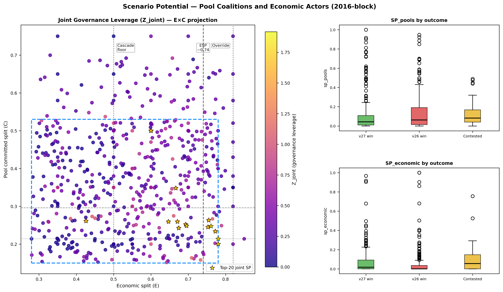
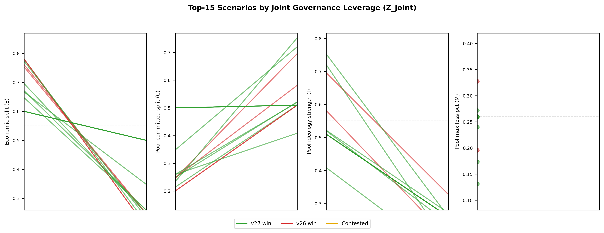

# Section 4.12 — Scenario Potential: Pool Coalition and Economic Actor Leverage

**Draft:** May 17, 2026
**Status:** DRAFT — complete.

---

## 4.12 Scenario Potential: Pool Coalition and Economic Actor Leverage

Section 4.11 applied the Scenario Potential framework to user nodes and recovered a structural null: user nodes cannot be pivotal in 2016-block fork outcomes at any tested parameter combination because their economic weight is negligible relative to exchanges and custodians. The null result validates the framework as a null-result detector — it correctly identifies actors who lack structural leverage.

This section applies the same framework to the two actor classes that *do* determine outcomes: mining pool coalitions and economic nodes (exchanges, custodians, payment processors). Scenario Potential for these actors is not a null — it produces a quantified governance leverage map that identifies precisely where in parameter space pool or economic actor decisions are most nearly pivotal, and which specific scenarios in the historical simulation record represent the highest-leverage governance moments.

---

### 4.12.1 SP_pools and SP_economic: Definitions

**SP_pools** measures the governance leverage of the committed pool coalition at a given parameter point. It is computed as the RF probability gradient with respect to `pool_committed_split`:

```
SP_pools(x) = |dP(v27_win) / d(pool_committed_split)|  evaluated at x
```

A high SP_pools value means a small shift in which large mining pools commit to which fork — for example, Foundry moving from v27-committed to v26-committed — would substantially change the predicted outcome probability. SP_pools peaks near the committed_split decision boundary (~0.296 in the Phase 3 transition zone, ~0.214 at the Foundry flip-point) and approaches zero in clean-outcome regions far from the threshold where the outcome is determined regardless of pool structure.

**SP_economic** measures the governance leverage of exchanges and custodians at a given parameter point. It is computed as the RF probability gradient with respect to `economic_split`, gated by position within the inversion zone:

```
SP_economic(x) = |dP(v27_win) / d(economic_split)| × gate(economic_split)
```

where `gate(e)` is a triangular function that equals 1.0 at the ESP (~0.74), decays linearly to 0 at the cascade floor (E=0.50) and the economic override threshold (E=0.82), and is identically 0 outside [0.50, 0.82]. The gate encodes the structural finding that exchange and custodian custody decisions are genuinely pivotal only within the inversion zone. Below the cascade floor, v27 cannot win regardless of economic action; above the override threshold, v27 wins regardless. Economic actor leverage is structurally zero outside these bounds.

Both scores are min-max normalized to [0, 1] across the dataset. The joint governance leverage score combines them:

```
Z_joint = SP_pools + SP_economic + 0.5 × contentiousness
```

Contentiousness enters with a lower weight (0.5) because it is a precondition — the outcome must be in play — rather than the primary measure of leverage. `surprise = Z_joint × (1 − outcome_certainty)` identifies scenarios where high leverage was structurally available but the outcome resolved cleanly anyway.

**Gradient step size selection.** The SP scores are computed via centered finite difference — each scenario's parameter is nudged ±Δx, the RF is queried at both points, and the absolute change in predicted probability divided by the step is the gradient estimate. Because the RF probability surface is piecewise constant (built from 600 binary tree votes), the choice of Δx requires care: too small and the nudge fails to cross any tree split threshold, returning a spurious zero; too large and the estimate averages over multiple distant thresholds, blurring local boundary structure. A sensitivity analysis across Δx ∈ {0.001, 0.005, 0.01, 0.02, 0.05} on the full dataset quantified both failure modes. At Δx=0.001, 57.1% of scenarios returned zero gradient — the step was too small to cross tree splits consistently. At Δx=0.05, the correlation with adjacent delta choices dropped below r=0.45, indicating over-smoothing. The pair Δx=0.01 and Δx=0.02 correlated at r=0.75 with each other while Δx=0.02 reduced the zero-gradient rate from 22.7% to 17.0% — a meaningful improvement with no loss of inter-delta agreement. Δx=0.02 was selected as the best balance between threshold-miss noise (too small) and boundary blurring (too large) and is used throughout this section. Source: `tools/discovery/scenario_potential.py` (`GRADIENT_DELTA = 0.02`).

Source: `tools/discovery/scenario_potential.py`. Dataset: n=590 scenarios, 15 sweeps, 2016-block retarget, RF OOB accuracy 79.8%.

---

### 4.12.2 The Joint Governance Leverage Surface

**Figure AA — Joint governance leverage (Z_joint) across the E×C parameter projection.** Each scenario is plotted at its (economic_split, pool_committed_split) coordinates with color indicating Z_joint (plasma colormap; brighter = higher governance leverage). Gold stars mark the top-20 scenarios by joint Z_joint. Structural thresholds are shown as dotted lines: cascade floor (E=0.50), ESP (E≈0.74, dashed), economic override (E=0.82); Foundry flip-point (C=0.214, dotted) and Phase 3 committed threshold (C≈0.296, dashed). The PRIM uncertainty box is overlaid in blue. Right panels show SP_pools and SP_economic distributions by outcome class (boxplots). Source: `tools/discovery/output/sp/`. See `docs/figures/fig_sp_surface.png`.



The leverage surface has a clear structure. The highest Z_joint values concentrate in a narrow band at the intersection of two boundaries: economic_split near the ESP (0.70–0.78) and pool_committed_split near the Foundry flip-point (0.20–0.26). This intersection is the maximum governance leverage region — both pool coalition structure and economic custody decisions are simultaneously near-pivotal there. Moving away from this intersection in either dimension reduces leverage: as economic_split rises above 0.82 or falls below 0.50, SP_economic drops to zero; as pool_committed_split moves away from either threshold, SP_pools decays.

The right panels reveal the SP structure by outcome class. SP_economic is highest for contested outcomes (mean=0.095) and v27-dominant outcomes (mean=0.073), and lowest for v26-dominant (mean=0.054). This is structurally expected: v26-dominant outcomes tend to occur at low economic_split values below the cascade floor, where the gate function zeros out SP_economic entirely. Scenarios where v27 wins or the outcome is contested are more likely to occur within the inversion zone where economic actor leverage exists.

SP_pools shows a different pattern — it is nearly equal across all three outcome classes (v27: 0.124, v26: 0.138, contested: 0.121). Pool commitment leverage does not sort by outcome direction because the committed_split threshold separates outcome classes rather than being concentrated in one. Scenarios on either side of the threshold have similarly steep RF gradients — the boundary is equally sharp from both sides.

---

### 4.12.3 Top Leverage Scenarios

**Table 19. Top-10 scenarios by joint governance leverage (Z_joint).**

| Rank | Sweep | E | C | I | M | Outcome | SP_pools | SP_econ | Z_joint |
|:----:|-------|:---:|:---:|:---:|:---:|---------|:--------:|:-------:|:-------:|
| 1 | `targeted_sweep7_esp_2016` | 0.780 | 0.214 | 0.510 | 0.260 | v27_dominant | 0.719 | 0.966 | 1.918 |
| 2 | `lhs_2016_full_phase3_merged` | 0.761 | 0.247 | 0.582 | 0.196 | v26_dominant | 0.948 | 0.903 | 1.902 |
| 3 | `committed_2016_high_econ` | 0.780 | 0.200 | 0.510 | 0.260 | v26_dominant | 0.696 | 1.000 | 1.785 |
| 4 | `committed_2016_sigmoid` | 0.780 | 0.200 | 0.510 | 0.260 | v26_dominant | 0.696 | 1.000 | 1.785 |
| 5 | `lhs_2016_full_phase3_merged` | 0.753 | 0.245 | 0.696 | 0.327 | v26_dominant | 0.553 | 0.862 | 1.455 |
| 6 | `lhs_2016_full_phase3_merged` | 0.671 | 0.260 | 0.520 | 0.240 | v27_dominant | 1.000 | 0.194 | 1.439 |
| 7 | `lhs_2016_full_phase3_merged` | 0.772 | 0.234 | 0.753 | 0.260 | v27_dominant | 0.156 | 0.917 | 1.301 |
| 8 | `lhs_2016_6param` | 0.647 | 0.260 | 0.409 | 0.131 | v27_dominant | 0.916 | 0.036 | 1.296 |
| 9 | `lhs_2016_full_phase3_merged` | 0.696 | 0.248 | 0.522 | 0.272 | v27_dominant | 0.813 | 0.209 | 1.283 |
| 10 | `lhs_2016_full_phase3_merged` | 0.666 | 0.348 | 0.721 | 0.174 | v27_dominant | 0.103 | 0.904 | 1.278 |

The rank-1 scenario — `targeted_sweep7_esp_2016 sweep_0007` — is the highest governance leverage point in the entire 590-scenario dataset, with Z_joint=1.918. Its parameters (E=0.780, C=0.214) sit at the ESP × Foundry flip-point intersection: economic support is at the upper boundary of the inversion zone where exchange action is most nearly pivotal (SP_economic=0.966), and pool committed split is exactly at the structural threshold where Foundry's commitment flips the pool cascade (SP_pools=0.719). Both SP scores are simultaneously near-maximum. This scenario is the empirical realization of the governance configuration that maximizes the structural leverage of multiple actor classes simultaneously — it is the most contested governance moment in the simulation record.

Ranks 2–5 are notable for being **v26_dominant** outcomes with high Z_joint. Rank 2 (E=0.761, C=0.247) has SP_pools=0.948 and SP_economic=0.903 — the second highest joint leverage in the dataset — yet v26 prevails. Economic support is solidly in the inversion zone and committed split is above the Foundry flip-point; both actor classes had maximum available leverage and v26 still won. The ideology × max_loss interaction (I=0.582, M=0.196) explains this: the ideology × max_loss product sits near the diagonal threshold (Section 4.3.3), enabling committed v26 pools to resist the cascade despite the structural disadvantage. Ranks 3 and 4 are identical parameter configurations from two different sweeps (`committed_2016_high_econ` and `committed_2016_sigmoid`) — both at E=0.780, C=0.200, both producing maximum SP_economic=1.000 with v26_dominant outcomes.

Rank 6 (E=0.671, C=0.260) presents the opposite SP structure from rank 1: SP_pools=1.000 (maximum in the dataset) but SP_economic=0.194. Pool commitment is right at the transition zone threshold — the RF gradient over committed_split is maximally steep there — but economic support at E=0.671 is below the ESP, reducing economic leverage. This is the scenario where pool coalition decisions are maximally pivotal but exchange and custodian decisions are not.

---

### 4.12.4 Surprise Scenarios: High Leverage, Clean Resolution

The surprise score identifies scenarios where governance leverage was structurally available — both pool and economic actors were near-pivotal — but the outcome resolved decisively anyway. These are the "least expected" outcomes from a governance leverage perspective.

**Table 20. Top-10 surprise scenarios (high Z_joint, clean resolution).**

| Rank | Sweep | E | C | Outcome | Z_joint | Surprise |
|:----:|-------|:---:|:---:|---------|:-------:|:--------:|
| 1 | `targeted_sweep7_esp_2016` | 0.780 | 0.214 | v27_dominant | 1.918 | 1.048 |
| 2 | `lhs_2016_full_phase3_merged` | 0.761 | 0.247 | v26_dominant | 1.902 | 0.862 |
| 3 | `lhs_2016_full_phase3_merged` | 0.709 | 0.164 | v27_dominant | 1.132 | 0.808 |
| 4 | `lhs_2016_full_phase3_merged` | 0.696 | 0.248 | v27_dominant | 1.283 | 0.796 |
| 5 | `lhs_2016_full_phase3_merged` | 0.772 | 0.234 | v27_dominant | 1.301 | 0.785 |
| 6 | `econ_committed_2016_grid` | 0.600 | 0.200 | v27_dominant | 0.993 | 0.682 |
| 7 | `lhs_2016_full_phase3_merged` | 0.733 | 0.158 | v27_dominant | 1.135 | 0.651 |
| 8 | `targeted_sweep10_econ_threshold_2016` | 0.500 | 0.350 | v27_dominant | 0.865 | 0.616 |
| 9 | `targeted_sweep10_econ_threshold_2016` | 0.350 | 0.350 | v27_dominant | 0.877 | 0.611 |
| 10 | `lhs_2016_6param` | 0.495 | 0.159 | v27_dominant | 0.768 | 0.594 |

**Figure AB — Parameter profiles of the top-15 scenarios by Z_joint.** Parallel coordinates plot showing the four active parameter values for each top scenario, colored by outcome (green = v27_dominant, red = v26_dominant, gold = contested). Horizontal dashed lines show dataset medians for each parameter. The clustering of top-leverage scenarios near the center of the economic_split axis (0.65–0.78) and the low end of pool_committed_split (0.15–0.35) is visible — these are inversion zone scenarios near the Foundry flip-point. Source: `tools/discovery/output/sp/`. See `docs/figures/fig_sp_top_scenarios.png`.



The surprise rankings reveal two distinct archetypes:

**Archetype A — High leverage, v27 wins cleanly (ranks 1, 3–7).** These scenarios sit in the maximum leverage zone but pool commitment was sufficient to drive the cascade to completion and economic support reinforced it. The outcome resolved decisively in v27's favor despite the structural leverage available to both actor classes. Rank 1 (E=0.780, C=0.214) is the extreme case: the highest Z_joint in the dataset resolves to a clean v27 win — the leverage was real but both pool structure and economic conditions were aligned in the same direction, so the potential for intervention was present but unused.

**Archetype B — High leverage, v26 wins unexpectedly (rank 2).** Rank 2 (E=0.761, C=0.247, Z_joint=1.902) is the most analytically interesting case in the dataset: economic support is deep in the inversion zone, committed split is above the Foundry flip-point, both SP scores are near-maximum, yet v26 prevails. This is a genuine surprise — governance leverage was maximally available to both pool coalitions and economic actors favoring v27, and the outcome went the other way. The ideology × max_loss interaction is the mechanism: pool ideology was strong enough to hold v26 pools in place through the simulation window despite the structural disadvantage. This scenario has the highest surprise score among v26_dominant outcomes (surprise=0.862) and represents the most operationally disruptive governance configuration in the dataset — maximum leverage, unexpected direction.

Ranks 8 and 9 (both from `targeted_sweep10_econ_threshold_2016`) are notable for appearing at E=0.500 and E=0.350 — below or at the cascade floor where SP_economic is gated to zero. These are high-surprise v27 wins driven entirely by SP_pools: committed split at C=0.350 is well above the Foundry flip-point, and pool cascade dynamics resolved the outcome cleanly despite low economic support. They illustrate that pool-only leverage (without economic co-activation) can still produce decisive outcomes when committed_split is sufficiently above threshold.

---

### 4.12.5 Framework Validation: Comparing SP Across Actor Classes

The three Scenario Potential analyses — SP_user (Section 4.11), SP_pools, and SP_economic — together demonstrate the framework's capacity to discriminate between actor classes with and without structural governance leverage.

**Table 21. Scenario Potential framework comparison across actor classes.**

| Actor class | Structural weight | Max SP achievable | Bias ratio (PRIM) | Interpretation |
|-------------|:-----------------:|:-----------------:|:-----------------:|----------------|
| User nodes | W/W_total = 0.046% | ~0.05% | 1.256 | Structural null — weight ratio forecloses pivotality |
| Pool coalitions | Controls ~75% of hashrate | SP_pools max = 1.000 | — | Pivotal near committed_split thresholds |
| Economic nodes | Controls price signal | SP_economic max = 1.000 | — | Pivotal within inversion zone [0.50, 0.82] |

User nodes produce a near-unity bias ratio (1.256) in PRIM — the algorithm cannot concentrate user-pivotal scenarios because the 2197:1 weight ratio ensures SP_user is near-zero everywhere. Pool coalitions and economic actors produce SP scores that reach the maximum (1.000) and vary meaningfully across the parameter space — the framework correctly identifies both where leverage exists (inversion zone × Foundry flip-point neighborhood) and where it does not (clean-outcome regions far from both thresholds).

The governance implication is direct. A coordination campaign for v27 activation achieves maximum leverage when it targets the inversion zone simultaneously across both actor classes: pool operators near the Foundry flip-point (C ≈ 0.21–0.30) and economic actors near the ESP (E ≈ 0.70–0.78). Campaigns operating outside these ranges — recruiting additional committed pool hashrate when C is already well above 0.30, or seeking economic custody shifts when economic support is already above 0.82 — are targeting parameter regions where additional effort produces near-zero marginal governance leverage. The SP surface maps where effort translates into outcome influence and where it does not.

---

*Section 4.12 ends.*
