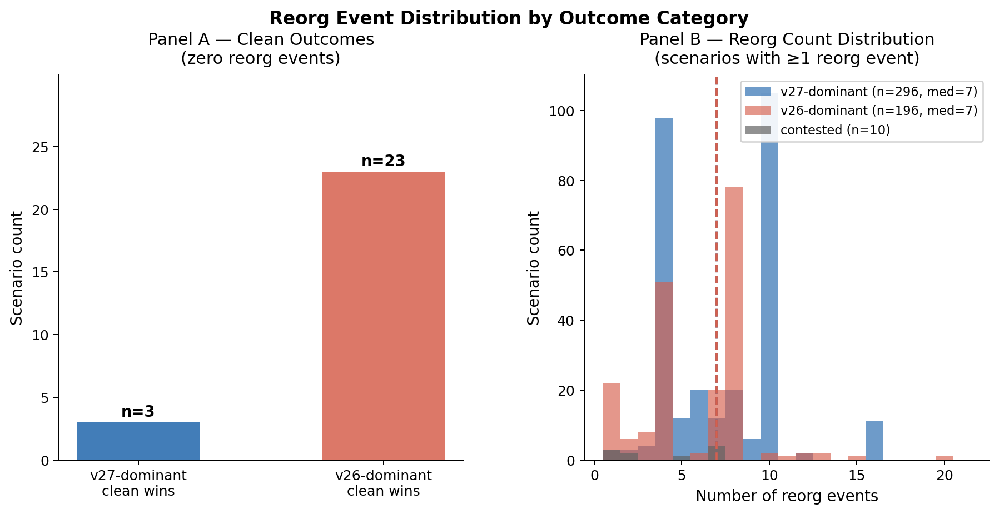
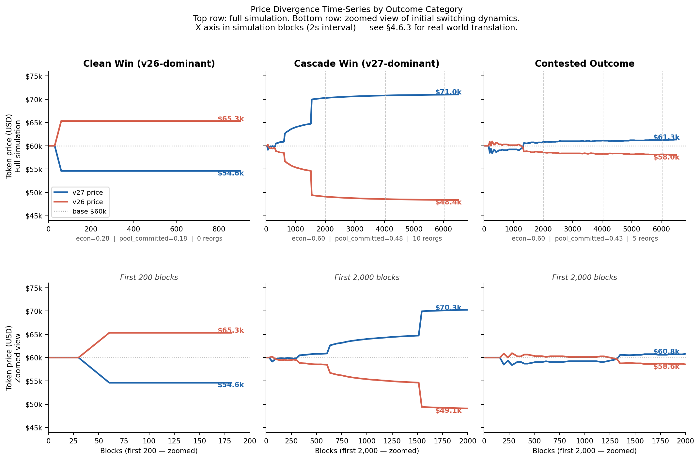

# Section 4.6–4.7 — Cascade Dynamics and Real-World Implications

**Draft:** May 2, 2026
**Status:** DRAFT — complete. Numbers from Results_Section_Skeleton_v4.md, phase3_results.md, price_divergence_sensitivity_2016 sweep.

---

## 4.6 Fork Dynamics and Cascade Signatures

The preceding sections characterize fork outcomes in terms of which fork wins and which parameters determine that result. This section examines *how* forks develop: the time-series signatures of cascade events, the price divergence patterns that drive pool switching, and the governance risk structure of the inversion zone.

---

### 4.6.1 Clean Outcomes vs. Cascade Events

Fork outcomes separate into two qualitatively distinct dynamic types based on the relationship between economic weight and pool commitment at the start of the simulation.

**Clean outcomes** occur when one fork dominates both economic and hashrate dimensions simultaneously — either econ_split is above the economic override threshold (~0.82) or below the cascade floor (~0.45), or pool_committed_split is far from the inversion boundary. In clean outcomes, the losing fork loses hashrate rapidly with zero or minimal reorg events. Neutral pools follow the economic signal immediately; committed pools on the losing side exhaust their loss tolerance within the first retarget epoch without generating competitive dynamics. The simulation resolves in one direction without meaningful contest.

**Cascade events** occur when the economic cascade mechanism is active — economic majority overcoming an initial hashrate deficit, or committed pool ideology sustaining a minority chain long enough for the price signal to develop. Cascade scenarios exhibit a characteristic signature: elevated reorg counts (typically 5–13 reorgs), a period of competitive mining on both chains, followed by rapid hashrate consolidation on the winning fork as neutral pools respond to the completed price divergence. In targeted sweep data, scenarios with 5 or more reorgs show an 86% v27 win rate when economic_split is above the cascade threshold, reflecting the systematic relationship between cascade activity and economic majority outcome.

The reverse cascade is the most striking single data point in the sweep program: sweep_0007 (starting hashrate = 90% v27, economic_split = 7% v27) results in v26 winning after 7 reorgs. A fork beginning with 90% of the network hashrate on the new-rules chain is nevertheless defeated when 93% of economic activity remains on the old-rules chain. This scenario directly demonstrates that hashrate majority is neither necessary nor sufficient for fork victory — the economic signal drives all neutral pools off the majority-hashrate chain within the simulation window.

**Symmetric cascade duration.** In the unbiased full-network LHS sample (n=532; lite-network, sigmoid oracle, and Phase 3 targeted sweeps excluded), v27-dominant and v26-dominant cascades share an identical median of 7 reorgs. Earlier analysis of biased samples that oversampled the inversion zone showed a lower v26 median (4 reorgs), suggesting v26 cascades resolve faster — an artifact of including Phase 3 scenarios where v26 wins were concentrated near the Foundry flip-point under short, ideology-limited cascades. On the unbiased data, cascade duration is symmetric: the number of reorgs required to resolve a fork is determined by the `ideology × max_loss` product of the *losing side's* committed pools, not by which fork ultimately wins. A highly committed v26 pool bloc delays the v27 cascade as effectively as a highly committed v27 pool bloc delays the v26 cascade. The winning fork's economic advantage accelerates the cascade only insofar as it increases the revenue loss rate on the losing side — a symmetric pressure regardless of direction.

**Figure X — Reorg Event Distribution by Outcome Category.** Panel A shows clean outcomes (zero reorg events, no pool switching): v27-dominant clean wins are rare (n=3); v26-dominant clean wins are more common (n=23), occurring when economic support is too low to initiate any cascade. Panel B shows the reorg count distribution for all scenarios with at least one reorg event. v27-dominant cascades (n=296) show a median of 7 reorgs, reflecting a two-stage cascade structure in which initial neutral pool drift and subsequent committed pool capitulation each contribute a cluster of activity. v26-dominant cascades (n=196) share the same median of 7 reorgs, reflecting symmetric cascade dynamics when the economic majority is on the v26 side. Contested outcomes (n=10) are sparse and low-count (all ≤7 reorgs), consistent with their characterization as parameter-locked stalemates where high ideology and loss tolerance sustain parallel mining without forcing capitulation. Source: n=532 valid full 60-node network scenarios; lite-network, sigmoid oracle, and Phase 3 LHS sweeps excluded. See `docs/figures/fig_reorg_distribution.png`.

---

### 4.6.2 Price Divergence Patterns

Token prices for each fork diverge from the common base price ($60,000) as economic nodes shift their transaction routing and custodial commitment. The magnitude and direction of divergence varies predictably across outcome categories:

- **Decisive v27 wins (high econ, high committed_split):** winning fork reaches $64,000–$72,000; losing fork falls to $48,000–$56,000. Divergence develops quickly and sustains.
- **Decisive v26 wins:** symmetric price pattern with directions reversed.
- **Contested outcomes:** both forks hover near $57,000–$62,000 throughout. Fewer economic nodes have switched, price divergence never exceeds the switching threshold of remaining nodes, and the fork persists without resolution.

Price divergence magnitude correlates with cascade completeness: longer stalemates produce less divergence because fewer economic nodes have switched. This relationship is bidirectional — less divergence means fewer nodes cross their switching threshold, which means less divergence, producing a self-reinforcing equilibrium in contested scenarios.

**Figure Y — Price Divergence Time-Series by Outcome Category.** Each column shows one representative scenario; top row shows the full simulation; bottom row zooms to the first 2,000 blocks to show initial switching dynamics. Blue = v27 price, red = v26 price, dotted line = base price ($60k). Dashed vertical lines mark 2016-block retarget epochs. X-axis in simulation blocks (2-second interval); see §4.6.3 for real-world translation and its limits.

*Left column — Clean Win (v26-dominant):* `econ=0.28`, `pool_committed=0.18`, 0 reorg events. Price separation is immediate — v26 rises to $65k, v27 falls to $55k within the first ~100 blocks. The simulation terminates at ~900 blocks when v27 loses all block production. The zoomed panel (first 200 blocks) confirms there is no competitive phase: prices diverge monotonically from the first block with no reversion.

*Center column — Cascade Win (v27-dominant):* `econ=0.60`, `pool_committed=0.48`, 10 reorg events. The zoomed panel shows the cascade structure clearly: prices hold near $60k for the first ~500 blocks while committed pools sustain both chains, then diverge sharply between blocks 500–1,500 as neutral pool defection accelerates. By block 2,000 the divergence is substantially complete. The full panel shows the final settled state — v27 at $71k, v26 at $48k — sustained for the remaining ~4,500 blocks after cascade completion.

*Right column — Contested Outcome:* `econ=0.60`, `pool_committed=0.43`, 5 reorg events. Both prices remain within 5% of $60k for the full 6,500-block simulation window. The zoomed panel shows early reorg activity produces minor price oscillation but no sustained divergence. Neither chain accumulates enough price advantage to push neutral pools decisively — the self-reinforcing equilibrium described above is visible: insufficient divergence → no additional pool switching → continued insufficient divergence. Final prices: v27 $61k, v26 $58k.

Source: individual scenario time-series from `realistic_sweep2/sweep_0041`, `lhs_2016_full_parameter/sweep_0002`, and `econ_committed_2016_grid/sweep_0021`. See `docs/figures/fig_price_divergence_timeseries.png`.

**Price divergence cap sensitivity.** The sensitivity of outcomes to the model's ±20% price divergence cap was tested via the `price_divergence_sensitivity_2016` sweep, running the same 12-scenario parameter grid at cap levels of ±10%, ±20%, ±30%, and ±40% (n=48 total). Table 11 summarizes the results.

**Table 11. price_divergence_sensitivity_2016: outcomes across price cap levels for fixed 12-scenario grid (2016-block retarget).**

| Cap level | v27 wins | v26 wins | Contested | Key finding |
|-----------|:--------:|:--------:|:---------:|-------------|
| ±10% | 5 | 3 | 4 | Cap binds: natural equilibrium gap is 13–16% in high-parameter scenarios; suppressing it to ±10% reduces pool loss pressure, enabling 3 v26 wins |
| ±20% | 3 | 0 | 9 | Cap no longer binds; stalled pool dynamics dominate |
| ±30% | 0 | 0 | 12 | Maximum stall: pool commitment insufficient to complete cascade at any cap level |
| ±40% | 8 | 0 | 4 | v27 wins via hardware-speed artifact: fast-server scenarios completed 2016-block retarget epoch within run window; slow-hardware scenarios remained contested |

The ±10% level is the only cap at which the price bound is causally active: natural price equilibria in these high-parameter scenarios would reach 13–16% divergence, so capping at ±10% artificially suppresses pool loss pressure and permits 3 v26 wins that would not occur at the correct cap level. Above ±10%, the cap is slack and outcomes are governed entirely by pool and economic dynamics.

The ±30% result isolates the pool commitment regime: in this 12-scenario grid, pool ideology and loss tolerance parameters are structurally insufficient to complete the cascade regardless of how large the price signal is allowed to grow. Increasing the cap further (±40%) does not change the dynamics — what changes outcomes at ±40% is a hardware timing artifact, not pool behavior. The contested zone in this grid is parameter-locked, not cap-locked.

Economic node switching behavior is invariant across all cap levels: 100% no-switch at every tested cap. The ideology/inertia dead zone permanently locks economic nodes in these scenarios regardless of price signal magnitude, confirming that the contested and v26-dominant outcomes in the inversion zone are not artifacts of the ±20% cap choice.

**Price floor from static custody (model limitation).** The cap sensitivity analysis characterizes the upper bound of price divergence; a complementary constraint operates at the lower bound. The price oracle's `economic_weight` component is driven by static `custody_btc` assignments and does not respond to chain liveness — a chain producing zero blocks retains its full custody-based price floor. In early sweep data (sweep10, econ=0.70, 144-block), a chain with 0% hashrate for ~300 blocks (600 simulation-seconds at the 2-second block interval) experienced only a ~6% price drop rather than the rapid collapse a fully dynamic model would produce. The practical consequence is that the model understates minority-chain price collapse in ghost-town scenarios: when one chain loses all block production, the opposing chain's price advantage builds more slowly than real market dynamics would generate, slightly delaying neutral pool migration and making clean-outcome thresholds marginally harder to cross. This conservative bias is consistent with the ±20% cap finding above — both model choices err toward understating the speed of price resolution rather than overstating it. The full bias assessment is documented in `assumptions.md §2.8`.

---

### 4.6.3 Cascade Timing and the Economic Lag

Cascade timing — the elapsed simulation time from fork inception to pool hashrate consolidation — varies substantially across scenarios. The simulation runs at a 2-second block interval (`--interval 2`), so all timing figures below are in simulation-seconds; the primary unit for real-world translation is **blocks and retarget epochs**, not wall-clock time (see caveat below). The primary determinant of cascade duration is the `pool_ideology_strength × pool_max_loss_pct` product (Section 4.3.3), not the economic or hashrate parameters:

- **Standard cascades** (low ideology × max_loss product): complete in approximately 700 simulation-seconds (~350 blocks) from fork inception — well within the first retarget epoch. Committed v26 pools exhaust their loss tolerance quickly, neutral pools follow the price signal, and the fork resolves without reaching difficulty adjustment.
- **High-resistance cascades** (ideology=0.80 + max_loss=0.35): complete in 10,920 simulation-seconds (~5,460 blocks) — approximately 15× longer and spanning nearly three 2016-block retarget epochs. Committed pools delay capitulation without changing the ultimate outcome when econ_split is above the economic override threshold (~0.82).

This range — ~350 to ~5,460 blocks — represents the window of maximum real-world disruption regardless of block interval. During this window, two competing chains are actively mining, exchanges face deposit/withdrawal decisions under price uncertainty, and users cannot be confident which chain their transactions will persist on.

**The economic lag** is the additional delay between pool cascade completion and full economic node migration. In Phase 3 full-switch cases (n=28), the pool cascade fires first at mean t=3,298 simulation-seconds (~1,649 blocks), with economic nodes responding approximately 3,506 simulation-seconds (~1,753 blocks) later (mean econ switch time = 6,804 simulation-seconds, ~3,402 blocks). The price gap magnitude at the time of economic switching is 41–47% in full-switch cases, versus 12–18% in no-switch cases — the gap must reach and sustain the higher range to cross economic node switching thresholds.

At 144-block retarget, the timing pattern inverts: the pool cascade completes earlier (~1,815 simulation-seconds, ~908 blocks) because the shorter survival window accelerates loss accumulation, but the economic lag extends to ~4,300–5,000 simulation-seconds (~2,150–2,500 blocks) because economic nodes process the price signal gradually over the remaining simulation window. Full-switch rates are higher at 144-block (55% vs. 46% in lhs_2016_6param), but the lag between pool resolution and economic adoption is 2–3× longer in block count.

**The econ lag as an observable signal — and its limits.** The model identifies a consistent structural sequence: pool hashrate consolidation precedes economic node migration, with a lag of approximately 1,750 blocks at 2016-block retarget. The qualitative signal — hashrate resolves first, institutional economic adoption follows — is a testable real-world observable: pool attribution data on-chain provides visibility into hashrate consolidation, while exchange deposit/withdrawal volumes and UTXO migration patterns provide visibility into economic adoption. If one chain achieves clear hashrate dominance but exchange-level activity has not migrated, the fork has completed its mechanistic phase but not its institutional adoption phase. The absence of economic migration after hashrate consolidation is a signal that the price gap was insufficient to trigger full adoption — placing the scenario in the no-switch regime regardless of the hashrate outcome.

**Important caveat on real-world timing.** The block-count translation (~1,750 blocks ≈ 12 real days at 10-minute block targets) is mechanistically valid for the model's block-driven components — pool revenue loss, difficulty retarget, and price divergence accumulation all scale correctly with block count. However, the human behavioral components of a real fork do not scale with block production. Pool operators respond to revenue losses on human decision timescales involving internal deliberation, legal review, and operational coordination that may be faster or slower than the block-count equivalent. Exchange listing decisions and custodial fork handling involve compliance review and counterparty agreement that operate on institutional timescales — potentially weeks to months — independent of how many blocks either chain has produced. The model treats these as algorithmically responsive to price signal magnitude; real institutions are not. The econ lag finding should therefore be understood as characterizing the *structure* of fork resolution (the sequencing of pool then economic adoption) rather than as a quantitative prediction of real-world timing. The specific block-count estimates carry substantial uncertainty when applied beyond the model's behavioral assumptions.

---

### 4.6.4 The Inversion Zone as Governance Risk

The inversion zone — economic_split ∈ [0.55, 0.78], pool_committed_split ∈ [0.30, 0.75] — represents a qualitatively distinct risk regime beyond what binary outcome classification captures. Within this zone, the fork outcome is determined not by aggregate economic or hashrate majority but by which side controls the structurally pivotal pool — Foundry USA in the modeled 2026 Bitcoin landscape. This creates three governance-specific hazards.

**Discontinuous outcome reversals.** A 4-percentage-point shift in pool_committed_split — from 0.20 to 0.30, crossing the ~0.214 Foundry flip-point — reverses the fork outcome entirely at econ=0.60–0.70. No continuous signal tracks this transition: aggregate hashrate shares on each side shift gradually while the underlying pivotal pool assignment changes discontinuously. A governance actor monitoring hashrate totals rather than per-pool ideological positions will not observe the approaching reversal.

**Misleading aggregate statistics.** Within the inversion zone, the side with higher aggregate economic support can lose, and the side with higher aggregate hashrate can lose, simultaneously. The winning condition is possession of the pivotal pool's commitment — a structural property invisible to aggregate monitoring. This is the practical implication of the E×C synergy term (+1.231) in the logistic regression: the two parameters are not independently predictive, so neither economic weight nor committed hashrate alone provides reliable forward guidance on outcome within this zone.

**Extended contentiousness.** Inversion zone scenarios have higher mean contentiousness than clean-outcome scenarios. The contested cluster in Phase 3 (Section 4.9) is specifically characterized by high ideology × max_loss parameters within the inversion zone's economic and committed-split ranges. These are the scenarios where pools are committed enough to sustain a genuine fork without being forced out, and loss-tolerant enough that economic pressure alone cannot complete the cascade. The result is a sustained dual-chain situation — the operationally riskiest outcome for exchange infrastructure, wallet software, and users attempting to transact.

**Natural frequency of contested outcomes.** The structural rarity of contested outcomes deserves explicit note. In the unbiased full-network LHS sample (n=532; same exclusion set as the figure), only n=10 scenarios produce a contested outcome — roughly 2% of parameter space. The Phase 3 targeted sweeps, which were designed to oversample the inversion zone, produced n=42 contested scenarios in a smaller sample; that count reflects deliberate oversampling, not natural frequency. The low natural rate follows directly from the model's dynamics: the price oracle exerts continuous and cumulative pressure on pool revenue, so contested requires three conditions to hold simultaneously — `economic_split` in [0.55, 0.78] (neither side has clean economic dominance), `pool_committed_split` near the Foundry flip-point (neither side has clear committed pool control), and `ideology × max_loss` high enough that committed pools survive the full simulation duration (13,000 simulation-seconds, ~6,500 blocks) without capitulating. This conjunction is genuinely rare in an unbiased parameter sample. The governance implication is two-sided: contested is the highest-risk outcome operationally, but reaching it requires a specific and observable configuration of pool ideology and economic split that would not arise accidentally.

---

## 4.7 Implications for Real-World Fork Assessment

The findings above suggest a structured reassessment of how fork risk is conventionally analyzed. The standard framing — "does the new version have majority hashrate support?" — addresses a parameter that is confirmed non-causal at realistic economic support levels (Section 4.2.1) and that becomes actively misleading within the inversion zone (Section 4.6.4). Three alternative questions better track the operative causal structure.

---

### 4.7.1 Three Operational Monitoring Questions

**Question 1: What fraction of economically significant Bitcoin activity is committed to each fork?**

`economic_split` is the dominant causal parameter at 144-block retarget and a critical threshold parameter at 2016-block. The economic threshold at ~0.50 is a hard floor: below it, no cascade is possible. The economic override at ~0.82 is a hard ceiling: above it, pool ideology becomes irrelevant to the final outcome. The entire operative parameter space lies between these bounds, making economic weight the primary quantity to assess.

Operationally, this corresponds to: which exchanges have committed to listing and supporting v27 deposits and withdrawals? Which custodians (institutional asset managers, ETF providers) are processing redemptions on v27? Which payment processors are routing v27 transactions? These are public or semi-public decisions — exchanges announce chain support policies, ETF providers publish their fork handling procedures, and on-chain transaction patterns reveal which UTXO sets are being spent on which chain. The fraction of circulating supply being actively transacted on each fork, weighted by entity economic significance, is an estimable quantity from public data.

**Question 2: Which major mining pools are ideologically committed versus profit-maximizing, and what is each committed pool's switching cost threshold?**

`pool_committed_split` is the dominant causal parameter at 2016-block retarget. Its threshold (~0.296 in the Phase 3 transition zone) is not determined by the total fraction of committed hashrate but by the structure of *which pools* are committed and at what ideological strength. The Foundry flip-point finding demonstrates that the identity of the pivotal pool — the largest single actor whose ideological assignment determines cascade direction — matters more than aggregate committed shares.

Operationally, pools' fork positions are partially observable from their public communications, social media statements, and block attribution data. Pool operators have historically been willing to signal their fork positions publicly (as in the SegWit2x signaling period). The more difficult estimation is `ideology_strength × max_loss_pct` — how much revenue loss a committed pool will accept before switching. Calibration against observed pool behavior during BCH and BSV fork events could provide empirical bounds; this remains an open research question.

**Question 3: Has the fork crossed the economic override threshold (~0.82), and if not, is the largest committed pool on the v27 or v26 side?**

This is the decision tree that the findings support:

- If `economic_split ≥ 0.82`: pool ideology is irrelevant to the final outcome. Monitor cascade timing (determined by ideology × max_loss) but not outcome direction.
- If `economic_split ∈ [0.50, 0.82]`: identify which side the largest committed pool (Foundry or equivalent) is assigned to relative to the ~0.214 flip-point. This single structural question determines whether the inversion zone is active and which direction it tilts the outcome.
- If `economic_split ≤ 0.50`: no cascade is possible; v26 wins regardless of pool configuration.

---

### 4.7.2 The Econ Lag as a Real-Time Fork Indicator

The model identifies a consistent structural sequence in fork resolution: pool hashrate consolidation precedes economic node migration by approximately 1,750 blocks at 2016-block retarget (~2,150–2,500 blocks at 144-block retarget). This sequencing — not the specific block counts — is the finding with real-world observational relevance. The block-count estimates carry the timing caveats documented in §4.6.3: they are mechanistically valid for the model's block-driven components but do not account for institutional decision cycles that operate on human timescales independent of block production.

With that caveat stated, the structural sequence provides two observable signals in practice:

- **Pool cascade completion** is visible on-chain: hashrate from attributed pools concentrates on one chain, and the competing chain's block production rate drops relative to its pre-fork share. This is the earlier signal.
- **Economic adoption** is visible at exchanges: the under-supported fork's deposit/withdrawal volumes decline, price divergence stabilizes, and custodial balance migration becomes observable in UTXO analysis. This signal follows hashrate consolidation.

The price gap magnitude at the time of economic switching is a diagnostic that does not depend on timing: gaps of 41–47% indicate the full-switch regime is active; gaps of 12–18% indicate no-switch. A fork that resolves at the pool hashrate level but shows only 12–18% price divergence is likely in the no-switch regime — economic adoption will not complete regardless of how much additional time passes, and the winning chain will hold its hashrate advantage without full economic migration. This price-gap diagnostic is robust to the timing uncertainty because it is magnitude-based, not duration-based.

---

### 4.7.3 What the Findings Do Not Support

The three monitoring questions above are bounded by the model's structural assumptions and calibration constraints. Several conventional claims about Bitcoin fork governance are neither supported nor refuted by these findings.

**The role of user-activated soft forks (UASF).** The User-PRIM analysis (Section 4.11) confirms that user nodes have no structural capacity to shift outcomes in the 2016-block regime under any tested parameter configuration. This does not mean UASF narratives are wrong in principle — it means that the operative mechanism of UASF (user nodes refusing to relay or build on non-compliant blocks) does not translate into a pivotal causal pathway in the modeled parameter space, given the 2197:1 economic weight ratio between institutional actors and user nodes. A UASF campaign that successfully shifts exchange and custodian positions — moving `economic_split` — would be causal. One that operates only through user node behavior would not.

**Fork outcomes beyond the ±20% price divergence regime.** All threshold findings are bounded by the model's ±20% maximum price divergence cap. Real fork events (BCH/BTC, BCH/BSV) have produced divergences of 80–95% over months. Under larger divergences, the dynamics change qualitatively: the losing chain's token may collapse before its difficulty adjustment fires, making hashrate suddenly causal in a way the model does not capture. The findings characterize short-to-medium-run fork dynamics; long-run dynamics under extreme divergence remain outside the model's scope.

**Threshold values as precise predictions.** The specific thresholds identified — ~0.50 economic floor, ~0.82 override, ~0.214 Foundry flip-point, ~0.296 committed_split transition zone — are calibrated to the modeled 2026 Bitcoin pool distribution and price oracle weights. The mechanisms that produce these thresholds are general; the specific numbers are not. A mining landscape with a different pool size distribution shifts the flip-point. A different economic weight coefficient shifts the economic thresholds. These findings establish the structure of fork dynamics and the identity of the operative parameters, not a universal quantitative prediction.

---

*Section 4.6–4.7 ends. Next: Section 4.9 — Phase 3: The Two-Layer Outcome Structure.*
