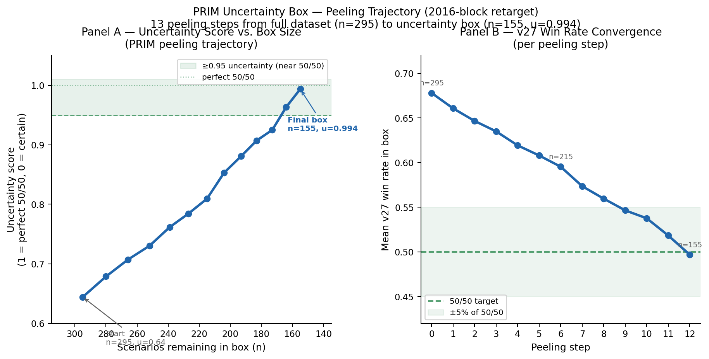
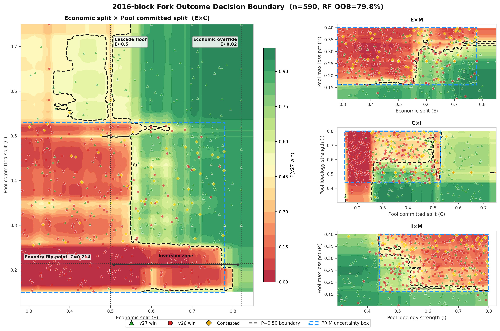

# Section 4.8 — Phase 2: Decision Boundary Fitting

**Draft:** April 9, 2026  
**Status:** DRAFT — complete. Figure placeholder noted in 4.8.3.

---

## 4.8 Phase 2: Decision Boundary Fitting

The targeted sweep program (Phase 1) identified which parameters cause fork outcomes and mapped thresholds along individual dimensions. Phase 2 applies three complementary statistical methods — Random Forest classification, Logistic Regression with interaction terms, and Patient Rule Induction Method (PRIM) — to all labeled Phase 1 scenarios simultaneously, estimating the full 4-dimensional decision boundary as a joint function of the four active parameters.

**Data.** Phase 2 uses all valid labeled scenarios separated by retarget regime. The 144-block dataset (n=268) includes full-network sweeps only, excluding `lhs_144_6param` due to the economic quantization artifact on the lite network (Section 4.2, §4.2.4). The 2016-block dataset (n=298) includes all valid 2016-block sweeps. Active inputs to all models are `economic_split` (E), `pool_committed_split` (C), `pool_ideology_strength` (I), and `pool_max_loss_pct` (M).

---

### 4.8.1 Random Forest Feature Importance: Causal Rank Reversal Confirmed

Random Forest classification was fitted separately for each regime. Table 7 reports feature importance (mean decrease in impurity) and out-of-bag (OOB) accuracy.

**Table 7. Random Forest feature importance by retarget regime. Bold = dominant parameter in each regime.**

| Parameter | 144-block (n=268) | 2016-block (n=298) | Rank change |
|-----------|:-----------------:|:------------------:|:-----------:|
| `economic_split` | **77.2%** | 20.2% | #1 → #2 |
| `pool_committed_split` | 11.3% | **52.8%** | #2 → #1 |
| `pool_max_loss_pct` | 5.5% | 17.1% | #4 → #3 |
| `pool_ideology_strength` | 6.0% | 9.9% | #3 → #4 |
| **RF OOB accuracy** | **80.0%** | **83.2%** | |

The causal rank reversal is confirmed on the full multi-sweep dataset without lite-network quantization contamination. At 144-block, `economic_split` is the dominant predictor by a wide margin (77.2%, approximately 4× the next-best parameter). At 2016-block, `pool_committed_split` displaces it as dominant (52.8%, 2.6× the next-best parameter). This is not a marginal effect: the two parameters swap rank positions entirely between regimes.

The direction of the mechanism is consistent with the Phase 1 findings. At 144-block, the retarget fires quickly enough that economic price signals determine the cascade before pool commitment structure becomes binding — economic alignment governs who wins. At 2016-block, pools must sustain their ideological commitment through an entire 2016-block epoch before any difficulty adjustment fires; the structural question of which pools are committed to which fork becomes the binding constraint, and economic signals play a secondary amplifying role.

Two additional observations follow from Table 7. First, 2016-block dynamics are *more predictable*, not less — the higher OOB accuracy (83.2% vs. 80.0%) indicates the RF extracts a cleaner signal at 2016-block, consistent with pool commitment structure being a harder, more deterministic constraint than economic price signals. Second, `pool_max_loss_pct` rises from near-zero importance (5.5%) at 144-block to a meaningful secondary factor (17.1%) at 2016-block — at longer retarget intervals, how much loss a committed pool can absorb before switching becomes material to the outcome.

---

### 4.8.2 Logistic Regression Decision Surface

Logistic regression with all pairwise interaction terms was fitted on the 2016-block dataset to characterize the shape of the decision boundary. The full fitted equation is:

```
log-odds(v27_win) = 1.152
  + 1.231 · E · C
  − 0.618 · E · M
  + 0.568 · E
  + 0.504 · C · I
  − 0.374 · I · M
  − 0.289 · E · I
  − 0.278 · C · M
  + 0.177 · C
  + 0.085 · M
  − 0.083 · I
```

where E = `economic_split`, C = `pool_committed_split`, I = `pool_ideology_strength`, M = `pool_max_loss_pct`. Cross-validated accuracy: 77.5% ± 2.9%.

Three structural features stand out. First, the dominant term is the E×C interaction (+1.231) — the largest coefficient by a factor of two over any other term. This confirms that economic pressure and pool commitment are synergistic rather than additive: high economic support combined with high pool commitment produces v27 wins with dramatically higher probability than either factor alone would predict. The two parameters co-determine outcomes at 2016-block in a way that cannot be captured by separate thresholds on each.

Second, the main effects for I and M are near-zero (−0.083 and +0.085), while both parameters appear in multiple interaction terms. Ideology and loss tolerance operate almost entirely through interactions — they amplify or dampen the E and C effects rather than directly shifting the outcome probability. This is consistent with the Phase 1 finding that the ideology × max_loss *product* is the operative quantity (Section 4.3.3), not either parameter individually.

Third, the negative E×M coefficient (−0.618) captures an important antagonism: at high economic support levels, higher pool loss tolerance *hurts* v27 — committed v26 pools that can absorb larger losses persist longer under economic pressure, resisting the cascade. This interaction explains why maximum economic support (econ≥0.82) does not instantly resolve the fork; it still takes 700–10,920 seconds depending on pool loss tolerance (Section 4.3.4).

The 144-block logistic regression (CV accuracy: 59.8%, 10% above chance) is substantially weaker and not structurally reliable. The inverted signs for several terms relative to the 2016-block fit, combined with the lite-network quantization artifact, make the 144-block LR unsuitable for inference. The RF importance scores (Table 7) are more trustworthy for 144-block conclusions.

---

### 4.8.3 PRIM Boundary Analysis

PRIM (Patient Rule Induction Method, Bryant and Lempert 2010) was applied to identify axis-aligned regions of the 2016-block parameter space with concentrated outcome properties. Three PRIM runs were executed: v27-win maximization, outcome uncertainty maximization (the transition zone), and contentiousness maximization. Table 8 summarizes the three boxes.

**Input dimensionality.** PRIM was applied to the same pre-reduced 4-dimensional space used by the RF and logistic regression models: `economic_split`, `pool_committed_split`, `pool_ideology_strength`, and `pool_max_loss_pct`. The full swept parameter space includes six parameters; `pool_profitability_threshold` and `solo_miner_hashrate` are excluded from PRIM inputs because both were confirmed non-causal in prior sweeps (`lhs_2016_6param`: permutation importance ≈ 0, separation ≤ 0.011 across the full outcome range). Including non-causal parameters in PRIM degrades box quality by allowing the algorithm to waste peeling steps on dimensions with no outcome signal. The causal screening step is therefore a prerequisite for valid PRIM application, not a post-hoc rationalization: the 4-parameter input space is the space in which the decision boundary actually lives.

**Table 8. 2016-block PRIM results: three target regions.**

| PRIM target | Support | v27 win rate in box | n scenarios |
|-------------|:-------:|:-------------------:|:-----------:|
| v27-win maximization | 58.7% | 85.7% | 175 |
| **Uncertainty (transition zone)** | **51.0%** | **50.0%** | **152** |
| Contentiousness maximization | 40.3% | 36.0% | 120 |

The uncertainty box — the region of parameter space where outcomes are exactly 50/50 — is the primary Phase 3 target. Its bounds are:

| Parameter | Min | Max |
|-----------|-----|-----|
| `economic_split` | 0.28 | 0.78 |
| `pool_committed_split` | 0.15 | 0.53 |
| `pool_ideology_strength` | 0.44 | 0.80 |
| `pool_max_loss_pct` | 0.16 | 0.40 |

This box covers 51% of the full parameter space while containing a perfectly balanced 50/50 outcome split — indicating that the decision boundary runs through this region but Phase 1 sampling did not resolve its precise shape. Phase 3 LHS sampling within these bounds (Section 4.9) is designed to resolve this uncertainty.

The contentiousness box identifies the parameter region producing the highest on-chain disruption (mean contentiousness 0.360, versus 0.271 overall at 2016-block). Notably, this region has a 36% v27 win rate — substantially below the 67.1% overall rate. The most disruptive scenarios are not those where v27 wins cleanly; they are scenarios where pools are committed enough to sustain a real fork but not committed enough to resolve it decisively. The contentiousness box is a proper subset of the uncertainty box, shifted toward higher pool_committed_split [0.25, 0.57] and lower pool_max_loss_pct [0.10, 0.31] — capturing the "contested rather than decisive" region where committed pools create prolonged reorg periods without ultimately prevailing.


**Figure Z — PRIM Uncertainty Box Peeling Trajectory (2016-block retarget).** Panel A shows the uncertainty score (1 − 2|mean − 0.5|; 1.0 = perfect 50/50, 0 = certain) as a function of the number of scenarios remaining in the box, with the x-axis inverted to show peeling direction (large to small). Panel B shows the mean v27 win rate at each of the 13 peeling steps, converging monotonically from 0.678 (full dataset) toward 0.50 (the 50/50 target). At step 12 the box contains n=155 scenarios (53% of the dataset) with a mean v27 win rate of 0.497 and uncertainty score of 0.994 — effectively a perfect decision boundary region. Each peeling step removes the lowest-scoring 5th percentile of one parameter boundary, chosen greedily to maximize the uncertainty score gain. The smooth monotonic convergence in both panels confirms that PRIM is identifying a genuine transition zone rather than overfitting to noise: the uncertainty score increases at every step without reversal. Source: n=295 scenarios from 2016-block full-network and hybrid sweeps (VALID_SWEEPS_2016 in `tools/discovery/fit_boundary.py`). See `docs/figures/fig_prim_peeling_trajectory.png`.

The 144-block PRIM analysis returns near-degenerate results: after only three peeling steps the box still covers 92.5% of the data with a 49.6% v27 win rate. PRIM cannot identify a meaningful transition zone in the 144-block dataset. This reflects the non-uniform structure of the full-network 144-block grid sweeps — targeted sweeps at fixed parameter values do not provide the uniformly distributed coverage that PRIM requires to peel effectively. The 144-block RF importance scores (Table 7) remain valid; only the PRIM-derived boxes are uninformative at 144-block.

---

### 4.8.4 Contentiousness Structure

Contentiousness — a composite score combining reorg count, reorg mass, cascade timing, and economic lag — measures the degree of on-chain disruption a fork scenario produces, independent of which fork ultimately wins. Table 9 compares contentiousness across regimes.

**Table 9. Contentiousness comparison by retarget regime.**

| Metric | 144-block | 2016-block | Ratio |
|--------|:---------:|:----------:|:-----:|
| Mean contentiousness (all scenarios) | 0.132 | 0.271 | 2.1× |
| Mean contentiousness (v27-win scenarios) | ~0.09 | ~0.18 | ~2× |
| Mean contentiousness (high-chaos PRIM box) | — | 0.360 | — |

The 2016-block regime produces 2.1× more on-chain disruption on average. This is structurally expected: with a 2016-block retarget interval, a committed minority chain can persist for approximately 14 days (at 10-minute block targets) before its difficulty adjusts downward, accumulating extended periods of competitive mining, chain reorganizations, and economic uncertainty. The 144-block regime resolves more quickly and cleanly.

The relationship between contentiousness and outcome is non-monotonic at 2016-block. Scenarios where v27 wins decisively (high economic support, high committed_split, low max_loss) have *low* contentiousness — the cascade completes quickly. Maximum contentiousness occurs at intermediate committed_split where pools are committed enough to sustain a genuine fork but not committed enough to win. This intermediate zone — the high-chaos PRIM box (committed [0.25, 0.57], econ [0.34, 0.78]) — is the parameter region a governance actor should most want to avoid: it produces the most disruptive scenarios regardless of which fork ultimately prevails.

---

### 4.8.5 Decision Boundary Visualization


**Figure W — 2016-block decision boundary across all parameter projections.** The Random Forest probability surface (P(v27 win); n=587, OOB accuracy 80.1%) is shown for four parameter projections. The dominant E×C panel (left, occupying 60% of the figure width) plots the joint `economic_split` × `pool_committed_split` surface with `pool_ideology_strength` and `pool_max_loss_pct` held at their dataset medians. Three structural thresholds are annotated: the cascade floor (E≈0.50, below which v27 cannot win regardless of pool commitment), the economic override threshold (E≈0.82, above which v27 wins regardless of pool commitment), and the Foundry flip-point (C≈0.214, the pool committed-split level corresponding to the Foundry hashrate fraction). The inversion zone — the region between the two vertical threshold lines where the causal rank reversal operates — is indicated with a double-headed bracket. The PRIM uncertainty box (Table 8) is overlaid as a dashed blue rectangle on all panels. Supporting panels (right column, top to bottom): E×M (`economic_split` × `pool_max_loss_pct`), C×I (`pool_committed_split` × `pool_ideology_strength`), I×M (`pool_ideology_strength` × `pool_max_loss_pct`). Individual scenario outcomes (v27 win = triangle, v26 win = circle) are overlaid on all panels with semi-transparency. The P=0.50 decision contour (white dashed line) marks the estimated boundary between outcome regions in each projection. Source: VALID_SWEEPS_2016 (n=295) plus `lhs_2016_full_phase3_merged` (n=292), full-network 2016-block scenarios only. See `docs/figures/fig_decision_boundary_full.png`.

The dominant E×C panel in Figure W makes the causal structure visible in a single view. Below the cascade floor (E<0.50), the surface is uniformly blue regardless of C — economic support below the majority threshold prevents a v27 victory under any pool commitment structure. Above the economic override threshold (E>0.82), the surface is uniformly red — economic dominance is sufficient for a v27 win independent of pool structure. In the inversion zone (0.50 < E < 0.82), pool commitment is the operative variable: the P=0.50 contour runs roughly parallel to the E-axis in this region, confirming that C is the primary determinant of outcome when economic support is intermediate. The non-linearity at low C values (the boundary curves toward higher E requirements as C decreases) corresponds to the E×C interaction term dominating the logistic regression fit (coefficient +1.231, Section 4.8.2).

The three supporting panels reveal the secondary structure. The E×M panel shows the antagonism between economic support and pool loss tolerance captured by the −0.618 E×M interaction: at high E, higher M (committed v26 pools absorbing more loss) pushes the boundary rightward, requiring even higher economic support for a v27 win. The C×I panel shows the synergy captured by the +0.504 C×I interaction: high ideology strength amplifies the effect of high committed-split, shifting the 50/50 boundary toward lower C values. The I×M panel is the flattest of the three, consistent with the near-zero main effects for both parameters — their joint surface is nearly featureless, confirming that I and M operate primarily through interactions with E and C rather than independently.

---

*Section 4.8 ends. Next: Section 4.11 — User-PRIM: Scenario Potential for User Nodes.*
